# EasyCRM — Architecture **As Built** (HLD · LLD · Data Flow)

**Date:** 2026-07-29
**Scope:** exactly what exists on `main` at commit `908d9e6` (231 tests per `HANDOFF.md`; not
re-run for this document). Nothing aspirational appears here — for the finished-product picture see
[`2026-07-29-target-architecture.md`](2026-07-29-target-architecture.md).

**Source of truth this doc was derived from:** the code itself (`backend/src/main/java`,
`backend/src/main/resources/db/migration`), cross-checked against
`docs/superpowers/HANDOFF.md` and `docs/superpowers/specs/2026-07-22-easycrm-design.md`.

---

# Part 1 — High-Level Design (HLD)

## 1.1 What exists today, in one sentence

A single-deployable **Spring Boot 4.1 / Java 25 / PostgreSQL** modular monolith exposing a
JWT-authenticated REST API that runs the sales wedge **enquiry → quotation (versioned, GST-correct)
→ order**, renders the quotation to a deterministic PDF, and shares it over WhatsApp via a public
tokenized link — with tenant isolation enforced in four independent layers.

**There is no frontend.** The React app described in the design spec §5 has not been started.
The system's only clients today are HTTP callers and the test suite.

## 1.2 System context

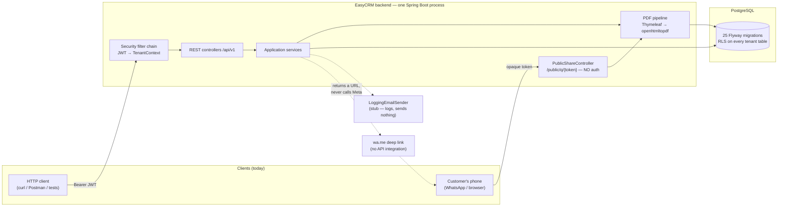

Two facts worth stating plainly, because they shape everything below:

- **`/public/q/{token}` is the only unauthenticated read path in the app.** It has no JWT, so it
  has no tenant — the tenant is resolved from a deliberately global `share_link` row and installed
  into `TenantContext` *before* the rendering transaction opens.
- **There is no outbound integration.** `EmailSender` has one implementation
  (`LoggingEmailSender`) that writes a log line. WhatsApp is a `wa.me` URL string returned to the
  caller; the server never talks to Meta.

## 1.3 Module map (as built)

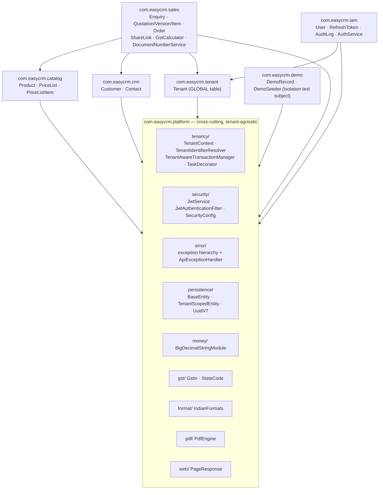

**Deviation from the spec worth knowing:** the design spec §6 prescribes a four-layer package
layout inside each module (`api/ domain/ application/ infrastructure/`). The code as built uses a
**flatter two-layer** shape: entities, repositories and services sit directly in the module package,
with `web/` and `web/dto/` beneath it. There is also **no MapStruct** — DTOs carry static `of(...)`
factories. And `sales` reaches into `catalog`/`crm` **repositories and entities directly**
(`PriceResolver` injects `ProductRepository`, `CustomerRepository`, `PriceListItemRepository`),
which the spec's ArchUnit boundary rule would forbid — that rule was never written. The only
ArchUnit rule that exists is the tenant-scoping one.

## 1.4 The four isolation layers (all four are real and tested)

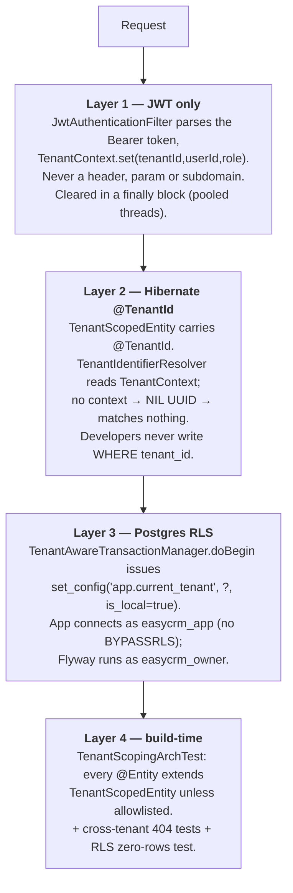

**`GLOBAL_TABLES` allowlist — exactly three entities**, each with a stated pre-auth reason:

| Entity | Table | Why it must be global |
|---|---|---|
| `Tenant` | `tenant` | It *is* the tenant registry. |
| `RefreshToken` | `refresh_token` | Looked up by SHA-256 hash before any tenant is known. |
| `ShareLink` | `share_link` | Resolves the tenant for the no-JWT public route. |

**A load-bearing config flag:** `spring.jpa.open-in-view: false`. With OSIV on, the `EntityManager`
opens in an interceptor *before* the controller runs, so the public share endpoint's
`TenantContext.runAs` would come too late — Hibernate pins a session's tenant once, at session-open.
Nothing in the build would catch the regression: no test fails, no exception is thrown, the endpoint
just silently reads under no tenant.

## 1.5 Correctness invariants the system holds today

| Invariant | Enforced by |
|---|---|
| Money is never a `double` | `BigDecimal` in Java, `NUMERIC(18,2)`/`(18,4)` in PG, **JSON string** on the wire (`BigDecimalStringModule`) |
| GST rounds per line, then sums (Tally parity) | `GstCalculator` — `HALF_UP` at 2dp per line; CGST and SGST each rounded *independently* |
| Document numbers are gapless, per tenant, per FY | `document_counter` + `SELECT … FOR UPDATE` inside the caller's transaction |
| A sent quotation renders identically forever | `quotation_item` snapshots name/HSN/UOM/rate; version freezes on send |
| One active enquiry per phone per tenant | Partial unique index `WHERE stage NOT IN ('CONVERTED','LOST')` + app pre-check + 409 backstop |
| One order per quotation | `UNIQUE(tenant_id, quotation_id)` on `sales_order` |
| One quotation per enquiry | `UNIQUE(tenant_id, enquiry_id)` on `quotation` (PG NULLs distinct) |
| Same PDF bytes for the same frozen version | `PdfEngine` pins the PDF `/ID` and dates off `version.sentAt` |
| Cross-tenant access looks like absence | RLS returns zero rows → `NotFoundException` → **404, never 403** |

---

# Part 2 — Low-Level Design (LLD)

## 2.1 Persistence model

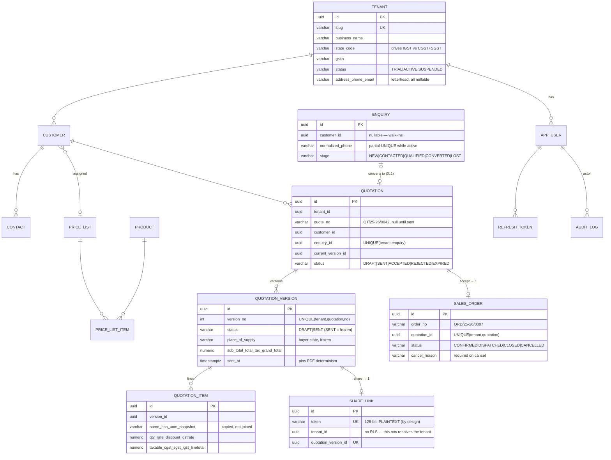

**Physical-name note:** the class is `Order`, the table is **`sales_order`** — `order` is a
reserved SQL word.

**Why `share_link`'s token is plaintext while `refresh_token`'s is SHA-256 hashed:** a hash cannot
be reversed, so re-sharing a version could not return *the same URL* — idempotent share (a link
already sent to a customer keeps working) requires storing the token. The blast radius differs
too: a leaked share token exposes one priced quotation PDF; a leaked refresh token is a session.

## 2.2 Request pipeline

```mermaid
sequenceDiagram
    autonumber
    participant C as Client
    participant F as JwtAuthenticationFilter
    participant SC as SecurityConfig chain
    participant Ctl as Controller
    participant Svc as @Transactional service
    participant TM as TenantAwareTransactionManager
    participant H as Hibernate session
    participant PG as Postgres (easycrm_app)

    C->>F: Authorization: Bearer <jwt>
    F->>F: jwt.parse() → TenantPrincipal(tenantId,userId,role)
    F->>F: TenantContext.set(p) + SecurityContext auth
    Note over F: invalid token → swallowed,<br/>request continues unauthenticated → 401 at the chain
    F->>SC: chain.doFilter
    SC->>Ctl: authorized
    Ctl->>Svc: call
    Svc->>TM: tx begin
    TM->>H: open session → resolver reads TenantContext<br/>(null → NIL UUID)
    TM->>PG: set_config('app.current_tenant', tid, is_local=true)
    Svc->>H: repo.findById(...)
    H->>PG: SELECT … WHERE tenant_id = ? (auto-appended)
    PG-->>H: rows RLS permits (0 if wrong/absent tenant)
    Svc-->>Ctl: DTO
    TM->>PG: COMMIT → GUC auto-clears (is_local)
    Ctl-->>C: JSON
    F->>F: finally { TenantContext.clear(); SecurityContextHolder.clear(); }
```

`is_local => true` matters: `SET LOCAL` cannot take a bind parameter, and a plain `SET` would leak
the tenant back into the pooled connection.

## 2.3 REST surface (complete, as built)

| Method & path | Auth | Notes |
|---|---|---|
| `POST /api/v1/auth/signup` | public | atomic tenant + first OWNER |
| `POST /api/v1/auth/login` | public | `slug + email + password`, generic 401 |
| `POST /api/v1/auth/refresh` | public | rotates the opaque token |
| `POST /api/v1/auth/logout` | public | revokes |
| `GET /api/v1/auth/me` | JWT | |
| `GET`/`PATCH` `/api/v1/tenant` | JWT | seller profile (letterhead) |
| `POST`/`GET`/`GET {id}`/`PUT {id}` `/api/v1/products` + `/{id}/activate|deactivate` | JWT | |
| same shape for `/api/v1/customers`, `/api/v1/price-lists` | JWT | |
| `POST`/`GET`/`PUT`/`DELETE` `/api/v1/customers/{customerId}/contacts` | JWT | nested |
| `POST`/`GET`/`DELETE` `/api/v1/price-lists/{id}/items` | JWT | nested |
| `POST`/`GET` `/api/v1/enquiries`, `GET`/`PATCH` `/{id}`, `POST /{id}/advance`, `POST /{id}/lose` | JWT | list filters: `stage`, `assignedTo`, `source` |
| `POST`/`GET` `/api/v1/quotations`, `GET /{id}` | JWT | list filters: `status`, `customerId` |
| `GET /{id}/versions`, `GET /{id}/versions/{versionNo}` | JWT | |
| `PATCH /{id}` (header), `PUT /{id}/items` (full replace) | JWT | DRAFT only |
| `POST /{id}/send` `/accept` `/revise` `/reject` `/expire` | JWT | |
| `GET /{id}/pdf?version=<n>` | JWT | defaults to current SENT version |
| `POST /{id}/share` | JWT | idempotent; returns public URL + `wa.me` URL |
| `GET`/`POST` `/api/v1/orders`… `/{id}/dispatch|close|cancel` | JWT | list filters: `status`, `customerId` |
| **`GET /public/q/{token}`** | **none** | PDF bytes, `inline`, `X-Robots-Tag: noindex` |
| `GET /actuator/health` | public | |

**Error contract** — one `@RestControllerAdvice`, envelope `{"error":{"code","message","fields"?}}`:

| Exception | Status |
|---|---|
| `NotFoundException` | 404 (also: every cross-tenant read) |
| `UnauthorizedException` | 401 |
| `ForbiddenException` | 403 |
| `ConflictException` | 409 |
| `DataIntegrityViolationException` | 409 — backstop for raced/bypassed unique pre-checks |
| `OptimisticLockingFailureException` | 409 — lost `@Version` race, not a 500 |
| `ValidationException` | 422 with a `fields` map |
| `MethodArgumentNotValidException` | 400 |

Note the deliberate 404-vs-422 split on the PDF route: an unknown quotation is 404, but a bad
`?version=` on a *visible* quotation is 422 — the record exists, the parameter is wrong.

**Authorization gap, stated plainly:** `SecurityConfig` gates `/api/**` on `authenticated()` only.
There is **no `@PreAuthorize` anywhere** and **no record-level visibility filter** — every
authenticated user in a tenant can read and mutate every record in that tenant, regardless of role
or `assigned_to`. Roles are minted into the JWT and stored, but nothing consumes them for
authorization yet.

## 2.4 The quotation aggregate — state machines

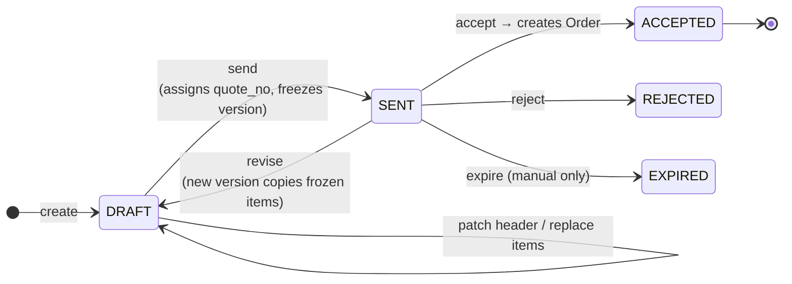

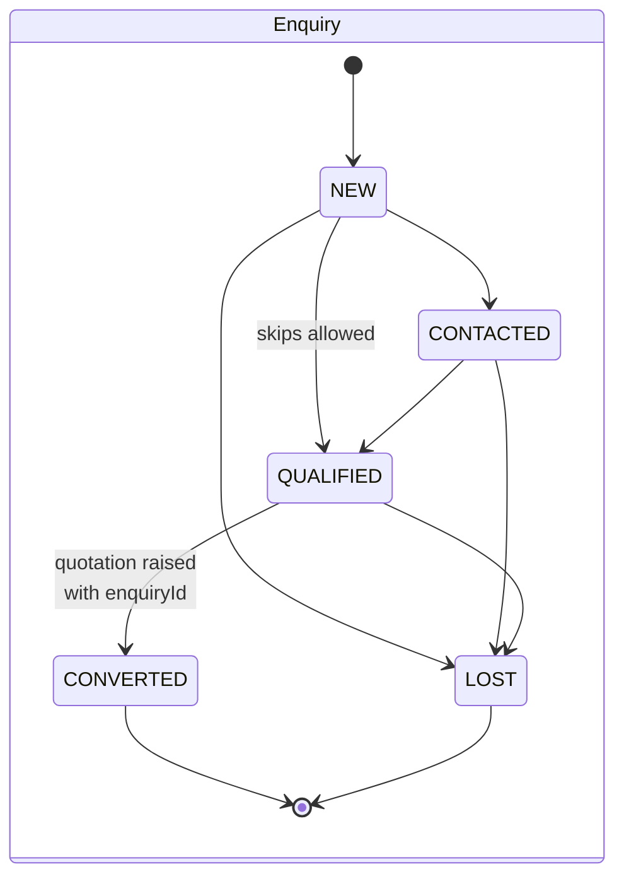

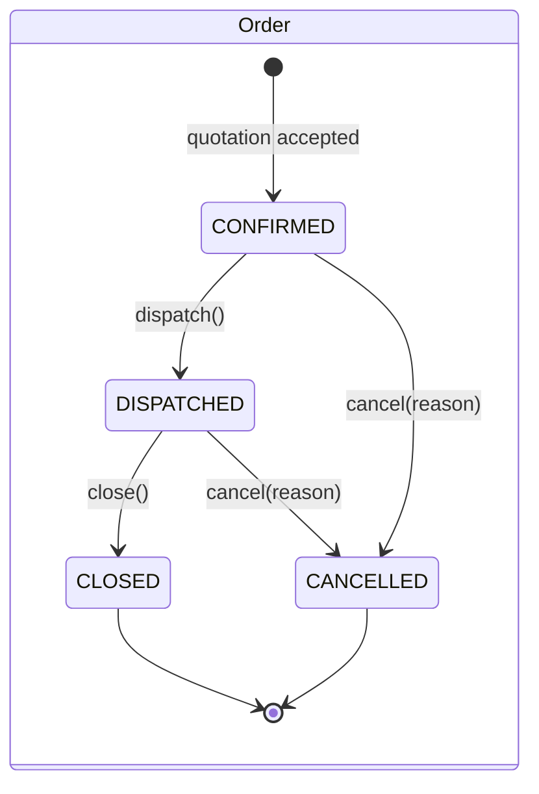

Every guard lives **in the entity**, not the service. `Order`'s transitions each name their own
precondition rather than comparing enum ordinals; `Enquiry.advanceTo` still couples to ordinal
order (guarded, but a reorder changes behaviour — a known backlog item).

## 2.5 Two algorithms worth reading closely

**GST (`GstCalculator`, pure static, no Spring):**

```
taxable   = round₂( qty × rate × (1 − discountPct/100) )
inter-state (buyer state ≠ tenant state):
    igst  = round₂( taxable × gstRate / 100 )
intra-state:
    cgst  = sgst = round₂( taxable × gstRate / 2 / 100 )   ← each rounded INDEPENDENTLY
lineTotal = taxable + cgst + sgst + igst
totals    = Σ per-line already-rounded values             ← never re-rounded
```

Rounding each half-rate independently can legitimately make `cgst + sgst` differ by ₹0.01 from a
single-rate computation. That is Tally's behaviour and therefore the correct behaviour.

**Gapless numbering (`DocumentNumberService`):** runs on the caller's transaction (default
`REQUIRED`), so `SELECT … FOR UPDATE` on `document_counter` and the increment commit atomically
with the `send`/`accept`. A rolled-back send releases the lock without consuming a number. `QUOTE`
and `ORDER` are separate counter keys; the FY label is Apr–Mar (`25-26`).

---

# Part 3 — Data flows

## 3.1 Signup — the "context before transaction" shape

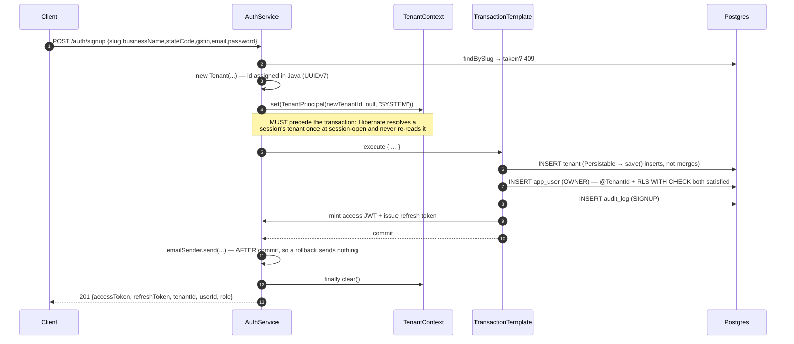

`login` and `refresh` follow the identical shape. `LOGIN_FAILED` audit uses `REQUIRES_NEW` so the
row survives the rollback that the 401 throw causes.

## 3.2 The wedge — enquiry → quotation → send → accept → order

```mermaid
sequenceDiagram
    autonumber
    participant U as User
    participant EC as EnquiryService
    participant QS as QuotationService
    participant PR as PriceResolver
    participant GC as GstCalculator
    participant DN as DocumentNumberService
    participant EV as ApplicationEventPublisher
    participant PG as Postgres

    U->>EC: POST /enquiries {contactPhone, source, requirement}
    EC->>EC: PhoneNormalizer.normalize
    EC->>PG: active-duplicate pre-check → 409 if found
    EC->>PG: INSERT enquiry (stage=NEW)
    Note over PG: partial UNIQUE index is the real guarantee;<br/>a raced insert → DataIntegrityViolation → 409

    U->>QS: POST /quotations {customerId, enquiryId?, items[]}
    QS->>PG: load customer → stateCode
    QS->>PG: load tenant → stateCode ⇒ interState?
    opt enquiryId present
        QS->>PG: enquiry.markConverted() — 422 if already terminal
    end
    QS->>PG: INSERT quotation (DRAFT) + quotation_version v1
    loop each item
        QS->>PR: resolve(customerId, productId)
        PR-->>QS: rate (price-list override → discount → base), name/HSN/UOM/gstRate
        QS->>GC: computeLine(qty, rate, discount, gstRate, interState)
        QS->>PG: INSERT quotation_item (snapshotted + computed)
    end
    QS->>PG: version.setTotals(Σ)
    Note over QS: the client's preview is never trusted — the server recomputes

    U->>QS: POST /quotations/{id}/send
    QS->>DN: nextQuoteNo(today) — FOR UPDATE on document_counter
    DN-->>QS: QT/25-26/0042
    QS->>PG: quotation.markSent() + version.markSent(now) ⇒ FROZEN

    U->>QS: POST /quotations/{id}/accept {poReference?, poDate?}
    alt already ACCEPTED
        QS->>PG: return existing order (idempotent)
        Note over QS: unless that order is CANCELLED → 422
    else SENT
        QS->>DN: nextOrderNo(today)
        QS->>PG: INSERT sales_order (CONFIRMED, totals snapshotted)
        QS->>PG: quotation.markAccepted()
        QS->>EV: publish QuotationAcceptedEvent
        EV->>PG: OrderAcceptedAuditListener → audit_log(QUOTATION_ACCEPTED)
    end
    QS-->>U: 200 OrderResponse
```

Two design points inside that flow:

- **Idempotency is state-based, not key-based.** There is no client idempotency key. A re-accept
  reads back the existing order via `UNIQUE(tenant_id, quotation_id)`; a genuine race is caught by
  the quotation's `@Version` optimistic lock → 409.
- **The event is a side-effect seam, not a return channel.** The order is created *inline* so the
  HTTP response carries it; the event exists for subscribers (audit today, WhatsApp confirmation
  later) and runs synchronously in the same transaction.

## 3.3 Revise — why a v2 is not a recomputation

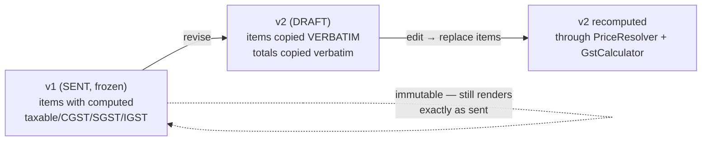

The copy is verbatim on purpose: re-resolving prices at revise time would silently change a line
the customer already saw, purely because a price list moved in between.

## 3.4 PDF render + share + public fetch

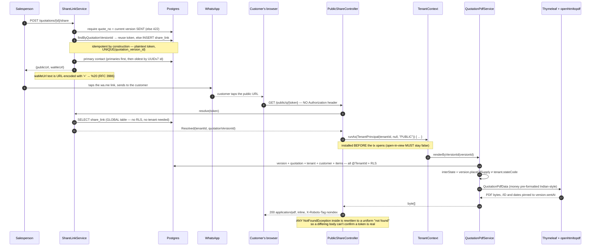

`interState` is read from the version's frozen `place_of_supply`, **not** inferred from whether any
line carries IGST — a wholly zero-rated inter-state quote would otherwise misprint CGST/SGST rows
for tax that was never charged.

## 3.5 Tenant isolation, end to end

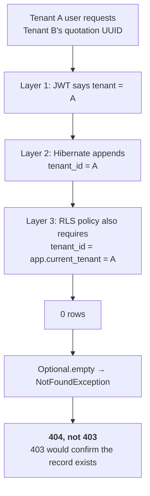

Proven three ways in the suite: cross-tenant controller tests per aggregate, `RlsIntegrationTest`
(raw JDBC with no GUC → zero rows), and `TenantScopingArchTest` (a new unscoped `@Entity` reddens
the build).

---

# Part 4 — What is deliberately *not* here

Stated so nobody plans against a feature that doesn't exist:

| Absent | Status |
|---|---|
| **Frontend** | Not started. No React app, no OpenAPI generation, no springdoc. |
| `activity` / `follow_up` | The "never lose a follow-up" promise is unbuilt. |
| Import module | Not started — spec §4 describes it fully; no code, no tables. |
| Scheduled jobs | None. No `@Scheduled` anywhere; quotation expiry is a manual endpoint. |
| Record-level visibility, `@PreAuthorize` | None. Every user in a tenant sees everything. |
| Rate limiting | None — including on `/public/q/{token}`, the only public route, which renders a PDF per hit. |
| Share-link expiry / revoke | None. A minted link renders forever; no delete path exists. |
| Cursor pagination | All lists are offset `Pageable`/`PageResponse`. |
| Attachments / object storage | No S3/MinIO, no `attachment` table. |
| Real email / WhatsApp API | `LoggingEmailSender` logs; `wa.me` is a returned string. |
| Order PDF | Out of scope by design — the quotation is the document customers ask for. |
| Non-Latin script in the PDF | Base-14 Helvetica only: Devanagari/Gujarati/Tamil renders as `#`, silently. |
| Idempotency keys | Accept is state-based instead; no key header anywhere. |
| Redis / Bucket4j / message broker | No infrastructure beyond Postgres. |

The full deferred-Minor backlog (22 items, ranked) lives in `docs/superpowers/HANDOFF.md` §8.
