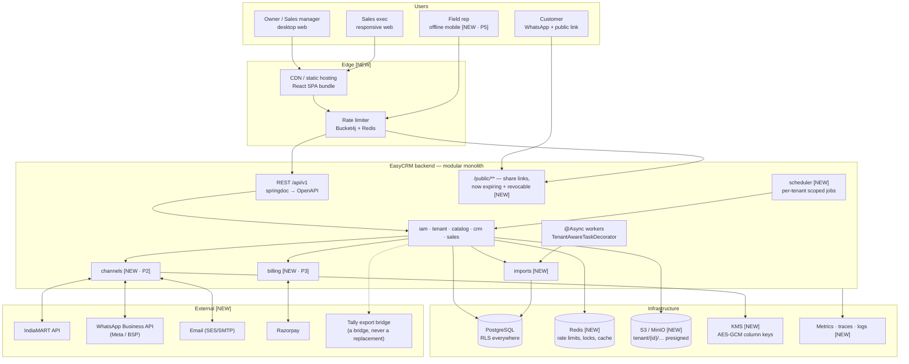
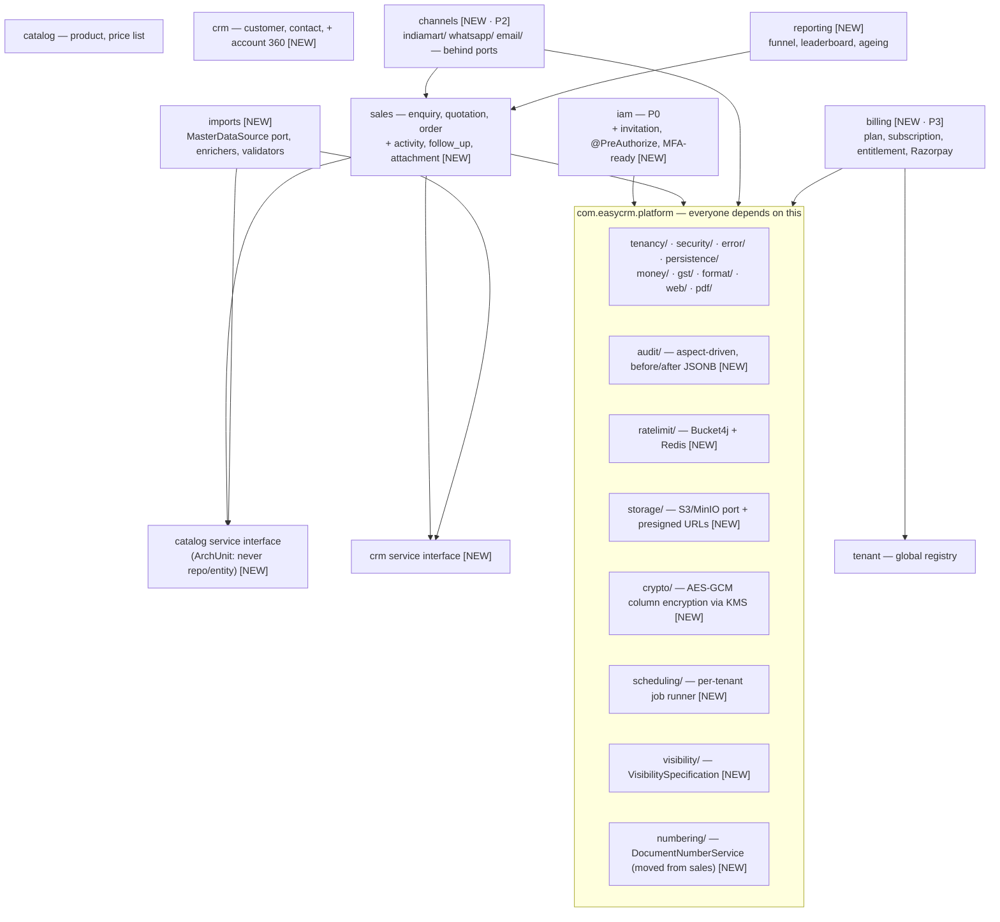
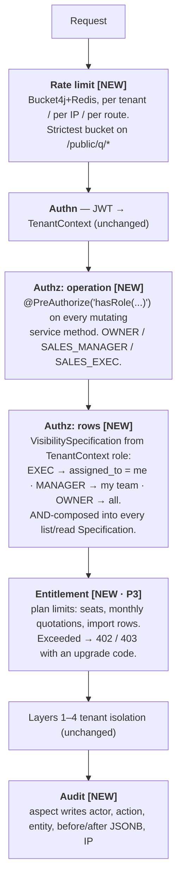
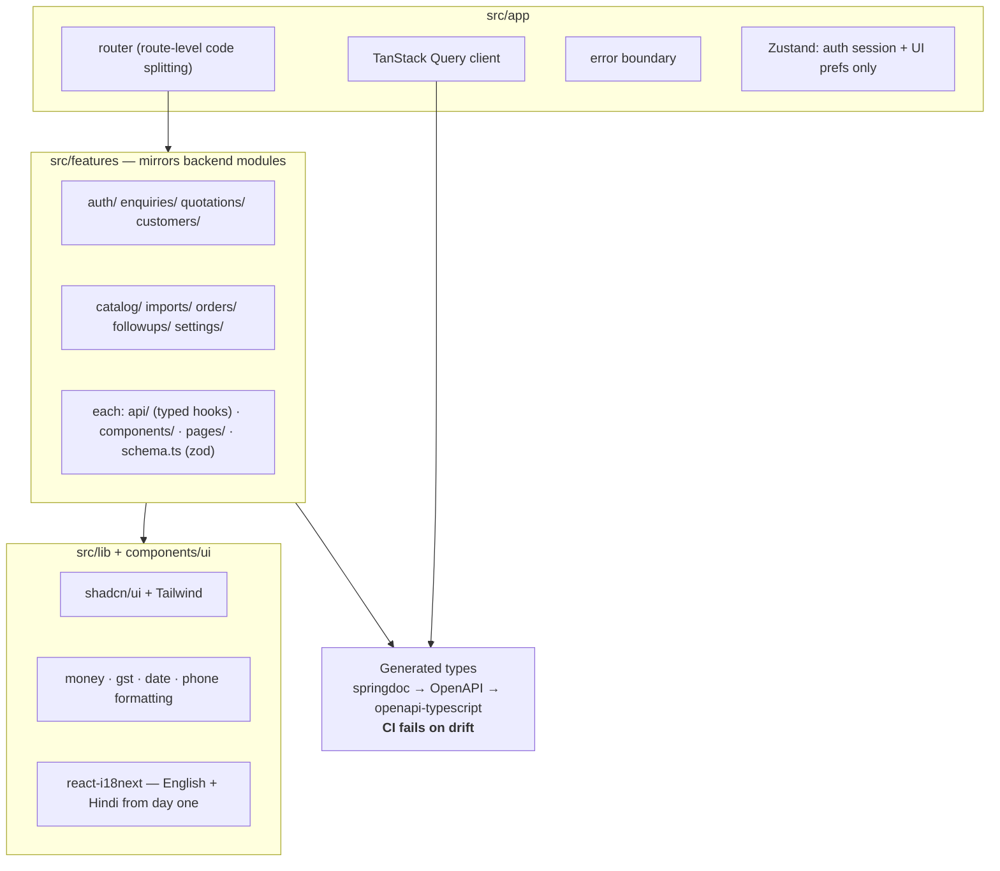
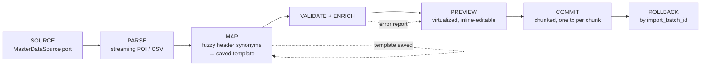
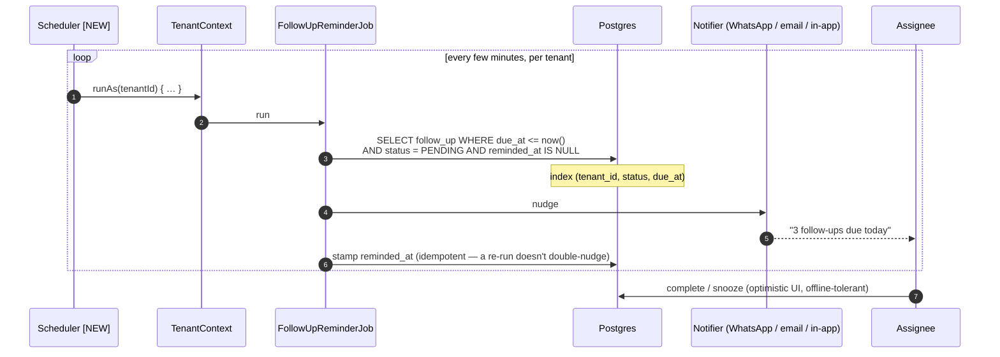
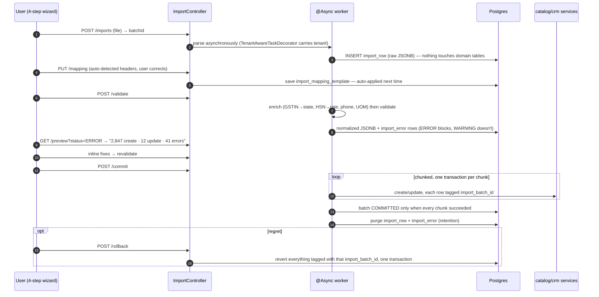
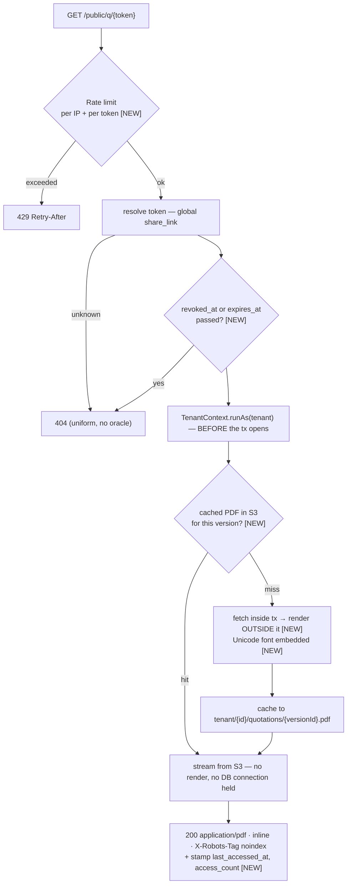
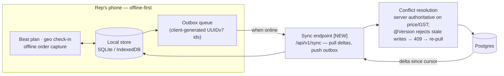

# EasyCRM — Architecture **at Completion** (HLD · LLD · Data Flow)

**Date:** 2026-07-29
**Scope:** the system assuming **every** feature currently on record is built — the design spec's
P0–P5 subsystems, the import module, the React frontend, and every deferred item in
`docs/superpowers/HANDOFF.md` §8 and its 22-item Minor backlog.

**This is a target, not a description.** Everything here that does not exist today is marked
**[NEW]**. For what is actually built, read
[`2026-07-29-current-architecture.md`](2026-07-29-current-architecture.md).

**Sources:** `docs/superpowers/specs/2026-07-22-easycrm-design.md` (§1 release plan, §4 import,
§5 frontend, §6 module structure), `HANDOFF.md` §8 + backlog, and the as-built code that everything
below extends.

---

# Part 1 — High-Level Design (HLD)

## 1.1 The completed product in one sentence

A multi-tenant SaaS platform where an Indian distributor's leads arrive automatically from
**IndiaMART and WhatsApp**, become **GST-correct versioned quotations** delivered as PDFs over the
**WhatsApp Business API**, convert into **orders** tracked to close, with **follow-ups that never
leak**, **bulk import** as the self-serve onboarding path, **Razorpay-billed subscriptions**, and a
**field-rep mobile app** — still stopping hard at the Order, with Tally untouched.

## 1.2 Release ladder (the spine of this document)

| Release | Subsystems | Adds |
|---|---|---|
| **R1** ✅ mostly built | P0 + P1 | tenancy/identity, wedge, PDF, `wa.me` |
| **R1** remainder **[NEW]** | P1 completion | activity + follow-up, import module, frontend, scheduled jobs, visibility, rate limiting |
| **R1.1** **[NEW]** | P2 | IndiaMART pull, WhatsApp Business API, inbound/outbound email |
| **R1.2** **[NEW]** | P3 | Razorpay subscriptions, plans, seat/usage entitlements |
| **R2** **[NEW]** | P4 | Accounts 360, repeat-order nudges, collections |
| **R3** **[NEW]** | P5 | Field-rep mobile — offline-first, separate architecture |

## 1.3 Target system context



## 1.4 Target module map



**Three structural changes from today's code:**

1. **Real module boundaries.** `sales` currently injects `ProductRepository`, `CustomerRepository`
   and `PriceListItemRepository` directly. In the target, cross-module access goes through
   published **service interfaces**, enforced by a **new ArchUnit rule** (`sales` may call a
   `catalog` service, never its repository or entity). This is the extraction seam that lets any
   module become a service later without a rewrite.
2. **Full four-layer packaging** per module (`api/ domain/ application/ infrastructure/`) as the
   spec §6 prescribes, with entities never leaving `domain` and DTO mapping via MapStruct.
3. **`DocumentNumberService` moves to `platform/numbering/`** — `billing` and `imports` will both
   want per-tenant sequences.

## 1.5 Isolation and authorization at completion

The four isolation layers are unchanged — they already work. What is **added above them**:



Two distinctions the spec is emphatic about, preserved here:
- RLS enforces the **tenant wall** (a security boundary); the visibility layer enforces
  **intra-tenant visibility** (a product rule). Different jobs, different places.
- `@PreAuthorize` gates *whether a role may call an operation*; visibility decides *which rows they
  see*.

## 1.6 Non-functional targets

| Concern | Target |
|---|---|
| Frontend bundle | < 200 KB gz initial, route-split; CI tests a throttled "Slow 4G" profile |
| Pagination | **Cursor-based** on every list (offset is a known scaling wall today) |
| API contract | springdoc → OpenAPI → `openapi-typescript`; **CI fails on drift** |
| PDF | Unicode-capable subset font embedded (Noto/DejaVu) — Indian scripts must not render as `#`; render moved **outside** the DB transaction |
| Idempotency | `Idempotency-Key` header on quotation-accept and order-create (double-tap on flaky 4G) |
| DPDP Act | per-tenant export (JSON+CSV), hard-delete with 30-day grace, WhatsApp consent record, full audit log |
| Secrets | per-tenant integration credentials (IndiaMART key, WABA token) AES-GCM column-encrypted, key in KMS |
| Files | S3/MinIO, keys `tenant/{tenantId}/…`, access only via short-lived presigned URLs |
| Observability | per-tenant metrics, trace ids on every response, structured logs that never contain a share token |

---

# Part 2 — Low-Level Design (LLD)

## 2.1 Target data model — the additions

Existing tables are unchanged in shape. New tables, grouped by subsystem:

```mermaid
erDiagram
    ENQUIRY ||--o{ ACTIVITY : "logged against"
    QUOTATION ||--o{ ACTIVITY : ""
    CUSTOMER ||--o{ ACTIVITY : ""
    ENQUIRY ||--o{ FOLLOW_UP : ""
    QUOTATION ||--o{ FOLLOW_UP : ""
    ANY_ENTITY ||--o{ ATTACHMENT : ""

    IMPORT_BATCH ||--o{ IMPORT_ROW : ""
    IMPORT_ROW ||--o{ IMPORT_ERROR : ""
    TENANT ||--o{ IMPORT_MAPPING_TEMPLATE : ""

    TENANT ||--o{ INVITATION : ""
    TENANT ||--|| SUBSCRIPTION : ""
    PLAN ||--o{ SUBSCRIPTION : ""
    SUBSCRIPTION ||--o{ INVOICE_REF : "Razorpay ids only"
    TENANT ||--o{ CHANNEL_CREDENTIAL : "AES-GCM encrypted"
    TENANT ||--o{ CHANNEL_MESSAGE : "inbound + outbound"

    ACTIVITY {
        uuid id PK
        uuid tenant_id
        varchar entity_type "ENQUIRY|QUOTATION|CUSTOMER"
        uuid entity_id "polymorphic"
        varchar type "CALL|WHATSAPP|EMAIL|VISIT|NOTE"
        text body
        varchar outcome
        timestamptz occurred_at
        uuid created_by
    }
    FOLLOW_UP {
        uuid id PK
        timestamptz due_at "indexed (tenant, due_at, status)"
        uuid assigned_to
        varchar status "PENDING|DONE|SNOOZED|CANCELLED"
        varchar entity_type_and_id
        timestamptz reminded_at "de-dupes the scheduler"
    }
    ATTACHMENT {
        uuid id PK
        varchar object_key "tenant/{tenantId}/…"
        varchar filename_content_type
        bigint size_bytes
    }
    IMPORT_BATCH {
        uuid id PK
        varchar source_type "CSV|EXCEL|TALLY_ODBC|BUSY"
        varchar entity_type "PRODUCT|CUSTOMER|PRICE_LIST_ITEM"
        varchar status "PARSING|MAPPING|VALIDATED|COMMITTED|ROLLED_BACK|FAILED"
        int counts_create_update_skip_error
    }
    IMPORT_ROW {
        uuid id PK
        int row_no
        jsonb raw
        jsonb normalized
        varchar status
        uuid matched_entity_id
        varchar action "CREATE|UPDATE|SKIP"
    }
    IMPORT_ERROR {
        uuid id PK
        varchar column_code_message
        varchar severity "ERROR blocks | WARNING does not"
    }
    CHANNEL_MESSAGE {
        uuid id PK
        varchar channel "INDIAMART|WHATSAPP|EMAIL"
        varchar direction "IN|OUT"
        varchar provider_message_id UK "idempotency"
        varchar status "QUEUED|SENT|DELIVERED|READ|FAILED"
        jsonb payload
    }
    SUBSCRIPTION {
        uuid id PK
        uuid plan_id
        varchar status "TRIALING|ACTIVE|PAST_DUE|CANCELLED"
        int seats
        timestamptz current_period_end
        varchar razorpay_subscription_id
    }
```



**Schema changes to existing tables:**

| Table | Change | Why |
|---|---|---|
| `share_link` | `+ expires_at`, `+ revoked_at`, `+ last_accessed_at`, `+ access_count` | backlog #4 — a link currently renders forever with no way to kill it |
| every domain table written by import | `+ import_batch_id` | makes rollback a single tagged delete/revert |
| `customer` | `+ credit_days`, `+ tags[]`, account-360 rollups | spec §2 fields not yet built |
| `quotation_version` | `+ pdf_object_key` | cache the rendered PDF in S3 instead of re-rendering per hit |
| `app_user` | `+ team_id` (or a `team` table) | `SALES_MANAGER` visibility needs "my team" to mean something |
| `tenant` | `+ plan_id`, `+ locale` | P3 entitlements, Hindi/English i18n |

**New `GLOBAL_TABLES` allowlist entries**, each needing the same explicit review the current three
got: `plan` (catalog of plans, tenant-independent) and any webhook-inbox table that must accept a
provider callback before a tenant is known.

## 2.2 Target REST surface — additions

```
# Activity & follow-up [NEW]
POST/GET  /api/v1/{enquiries|quotations|customers}/{id}/activities
POST/GET  /api/v1/follow-ups          ?assignedTo=&dueBefore=&status=
POST      /api/v1/follow-ups/{id}/complete | /snooze
GET       /api/v1/follow-ups/mine     # the mobile home screen

# Attachments [NEW]
POST      /api/v1/attachments/presign        # → short-lived PUT URL
GET       /api/v1/attachments/{id}/download  # → short-lived GET URL

# Import [NEW] — exactly the spec §4 contract
POST      /api/v1/imports                    # upload → batchId
GET       /api/v1/imports/{id}               # status + progress
PUT       /api/v1/imports/{id}/mapping
POST      /api/v1/imports/{id}/validate
GET       /api/v1/imports/{id}/preview       ?status=&cursor=
POST      /api/v1/imports/{id}/commit | /rollback
GET       /api/v1/imports/templates/{entity}

# IAM [NEW]
POST/GET  /api/v1/invitations · POST /api/v1/invitations/{token}/accept
GET/PATCH /api/v1/users/{id}                 # role, status, team

# Channels [NEW · P2]
POST      /api/v1/channels/{channel}/credentials   # AES-GCM at rest
POST      /api/v1/channels/whatsapp/send           # template message via WABA
POST      /public/webhooks/{channel}               # signature-verified inbound

# Billing [NEW · P3]
GET       /api/v1/plans · GET/POST /api/v1/subscription
POST      /public/webhooks/razorpay                # signature-verified

# Reporting [NEW]
GET       /api/v1/reports/funnel | /leaderboard | /quotation-ageing

# Share-link management [NEW]
DELETE    /api/v1/quotations/{id}/share            # revoke
GET       /public/q/{token}                        # + expiry, + rate limit
```

**Cross-cutting API changes:** cursor pagination replaces offset on every list
(`?cursor=&limit=`, response carries `nextCursor`); `Idempotency-Key` is honoured on
quotation-accept and order-create; springdoc annotations on every endpoint feed the generated TS
client.

## 2.3 Frontend architecture [NEW — nothing exists today]



| Concern | Choice | Why |
|---|---|---|
| Build | Vite + React + TypeScript | fast, boring, correct |
| Server state | TanStack Query | ~90% of state is server state |
| Client state | Zustand | session + prefs only |
| Forms | React Hook Form + Zod | the quotation builder is a nested `useFieldArray` |
| Tables | TanStack Table + virtualization | import preview renders 3,000 rows |
| Auth | access token **in memory**, refresh in httpOnly/Secure/SameSite cookie | a 401 triggers one refresh, queues in-flight requests, then retries or hard-logs-out |

**The quotation builder is the screen that decides the product:** keyboard-first (Tab through
lines, `Enter` adds a row, type-ahead product field), rate auto-fills from the customer's price list
and stays overridable, live client totals for responsiveness that are **overwritten by the server
response on save** — the server is always authoritative, exactly as `QuotationService.buildItems`
already behaves.

**Mobile scope:** responsive web, not a PWA, not offline. Three screens are mobile-optimized —
my follow-ups/dashboard, enquiry detail + log activity, quotation view + share. The builder,
catalog, price lists, import and settings are desktop tasks. Offline capture is P5's separate
architecture, deliberately not half-built earlier.

**Testing:** Vitest + Testing Library + MSW; **Playwright on four critical paths** — login,
enquiry→quote→send, the import wizard on the dirty CSV, and the **cross-tenant 404**, which runs in
CI as an E2E regression test.

## 2.4 Import module [NEW]



```java
interface MasterDataSource {                    // the port that makes Tally cheap later
    SourceMetadata describe();
    Stream<RawRecord> read(ImportRequest request);
}
// R1:   CsvSource, ExcelSource (streaming — a 5,000-row catalog must not sit in heap)
// Later: TallyOdbcSource, BusyExportSource — they inherit mapping, validation,
//        preview, commit and rollback unchanged.
```

- **Enrichers run before validators:** `GstinEnricher` (GSTIN → `state_code`, critical path — it
  decides IGST vs CGST/SGST), `HsnGstRateEnricher` (HSN → rate when blank, WARNING),
  `PhoneNormalizer` (E.164 — the existing one generalizes), `UomNormalizer` (`nos`/`pcs` → `PCS`).
- **Validators:** GSTIN checksum (`platform.gst.Gstin` already implements Luhn-mod-36), HSN 4/6/8
  digits, GST rate ∈ {0, 0.25, 3, 5, 12, 18, 28}, required fields, numeric ranges.
- **Matching:** items on `item_code` then normalized name; parties on GSTIN, then normalized phone,
  then fuzzy name — **surfaced for confirmation, never auto-merged**.
- **Modes:** `DRY_RUN`, `INSERT_ONLY`, `UPSERT`.
- **Retention:** staging rows are transient. On any terminal batch state
  (`COMMITTED`/`ROLLED_BACK`/`FAILED`) its `import_row`s and `import_error`s are purged —
  immediately after a successful commit, and by a scheduled sweep for terminal batches older than
  ~7 days. The `import_batch` summary is kept for audit. This bounds the staging tables regardless
  of throughput. (Distinct from rollback: rollback reverts *domain* records tagged by
  `import_batch_id`; retention cleans up *staging* rows afterwards.)

**Nothing touches domain tables until commit** — that single property is what buys preview, partial
correction and rollback. The internal onboarding SOP runs through this same wizard, no ops-only
scripts, so the importer is hardened by our own usage before self-serve launch.

## 2.5 Scheduled and async work [NEW]

Every job iterates tenants **explicitly**, each inside `TenantContext.runAs(tenantId, …)`. Never a
global cross-tenant query — that would be a hole straight through Layer 2.

| Job | Cadence | Notes |
|---|---|---|
| Follow-up reminders | every few minutes | due follow-ups → notification / WhatsApp nudge; `reminded_at` de-dupes |
| Quotation expiry | daily | `SENT` past `valid_until` → `EXPIRED` (today this is a manual endpoint only) |
| Share-link sweep | daily | expire/purge stale `share_link` rows |
| Import staging purge | daily | terminal batches older than ~7 days |
| IndiaMART poll (P2) | ~15 min | per-tenant creds, provider-id dedupe |
| Import execution | on demand | `@Async` + `TenantAwareTaskDecorator`, chunked commit, progress polled |
| Trial expiry (P3) | daily | `TRIAL` past `trial_ends_at` → `SUSPENDED` |

Multi-instance safety needs a lock the current code doesn't have: either ShedLock on Postgres or a
Redis lease per `(job, tenant)`. `TenantAwareTaskDecorator` already exists and already copies-then-
clears context across threads.

---

# Part 3 — Data flows at completion

## 3.1 Lead-to-cash, fully automated

```mermaid
sequenceDiagram
    autonumber
    participant IM as IndiaMART
    participant CH as channels/indiamart [NEW]
    participant EN as EnquiryService
    participant FU as FollowUpService [NEW]
    participant U as Sales exec (React app)
    participant QS as QuotationService
    participant WA as channels/whatsapp [NEW]
    participant CUST as Customer
    participant OS as OrderService

    Note over CH: scheduled per-tenant poll, decrypted creds
    IM-->>CH: new leads (~15 min)
    CH->>EN: create enquiry (source=INDIAMART, provider id dedupes)
    EN->>FU: auto-schedule "first contact" follow-up
    FU-->>U: due reminder → push/WhatsApp nudge
    U->>EN: log ACTIVITY(CALL, outcome) → advance to QUALIFIED
    U->>QS: build quotation (keyboard-first; server recomputes GST)
    QS-->>U: authoritative totals overwrite the client preview
    U->>QS: send → gapless QT/25-26/NNNN, version frozen
    QS->>WA: send template message + PDF link
    WA-->>CUST: WhatsApp (delivery + read receipts tracked)
    CUST-->>WA: "ok, send 200 units"
    WA->>EN: inbound message logged as ACTIVITY
    U->>QS: accept (Idempotency-Key) → Order CONFIRMED
    QS->>OS: QuotationAcceptedEvent → audit + WhatsApp confirmation + activity
    U->>OS: dispatch → close
    Note over OS: EasyCRM stops here. Tally does the invoice.
```

The event seam that makes this cheap **already exists**: `QuotationAcceptedEvent` and
`OrderStatusChangedEvent` are published today with exactly one subscriber each (audit). P2's
WhatsApp confirmation and the activity log arrive as **new subscribers, not edits** to
`QuotationService`.

## 3.2 Follow-up — the promise the product is sold on



## 3.3 Import — dirty CSV to committed catalog



## 3.4 Public share link, hardened



Four of today's backlog items close in this one diagram: rate limiting (#3), expiry/revoke (#4),
the non-Latin `#` corruption (#2 — the most user-visible limitation shipped), and holding a DB
connection across CPU-bound render work (#7).

## 3.5 Billing and entitlement [NEW · P3]

```mermaid
sequenceDiagram
    autonumber
    participant T as Tenant owner
    participant B as billing module
    participant RZP as Razorpay
    participant G as Entitlement guard
    participant S as Any service call

    T->>B: choose plan → checkout
    B->>RZP: create subscription
    RZP-->>B: POST /public/webhooks/razorpay (signature-verified, idempotent by event id)
    B->>B: subscription ACTIVE, seats + limits materialized
    S->>G: create quotation / invite user / start import
    G->>G: within plan limits?
    alt within
        G-->>S: proceed
    else exceeded
        G-->>S: 402/403 {code: PLAN_LIMIT_EXCEEDED, limit, used, upgradeUrl}
    end
    Note over B: daily job: TRIAL past trial_ends_at → SUSPENDED;<br/>SUSPENDED tenants fail login with the same generic 401 path that exists today
```

## 3.6 Field-rep mobile [NEW · P5] — a genuinely different architecture



Client-generated UUIDv7 ids make the outbox naturally idempotent — a replayed push is a no-op
insert, not a duplicate. Pricing and GST are **never** computed on the device; the server recomputes
on sync and the client's optimistic totals are overwritten, the same rule the web builder follows.

---

# Part 4 — Gap ledger: today → target

| Area | Today | Target | Size |
|---|---|---|---|
| Frontend | none | full React SPA + generated client + Playwright | **XL** |
| Activity / follow-up | none | 2 aggregates + reminder scheduler + mobile screens | **L** |
| Import module | none | 4 tables, port + enrichers + validators, async pipeline, 4-step wizard | **XL** |
| Scheduled jobs | none | 7 jobs, per-tenant scoped, multi-instance-safe | **M** |
| Authorization | authenticated-only | `@PreAuthorize` + `VisibilitySpecification` + teams | **M** |
| Rate limiting | none | Bucket4j + Redis, strictest on `/public/q/*` | **S** |
| Share links | permanent, unrevocable | expiry + revoke + access stats | **S** |
| Pagination | offset everywhere | cursor everywhere | **M** |
| PDF | Latin-1 only, in-transaction, re-rendered per hit | Unicode font, rendered outside tx, cached to S3 | **S–M** |
| Object storage | none | S3/MinIO + presigned URLs + `attachment` | **M** |
| Channels (P2) | `wa.me` string only | IndiaMART poll + WABA + email, behind ports | **XL** |
| Billing (P3) | none | plans, Razorpay, entitlements | **L** |
| Accounts 360 (P4) | none | customer rollups, reorder + collection nudges | **L** |
| Field mobile (P5) | none | offline-first client + sync endpoint | **XL** |
| Module boundaries | `sales` uses `catalog`/`crm` repos directly | service interfaces + ArchUnit rule | **S** |
| Idempotency | state-based on accept | `Idempotency-Key` header | **S** |
| Observability | none | metrics, traces, per-tenant dashboards | **M** |
| Secrets | JWT secret in env | KMS + AES-GCM per-tenant credential columns | **M** |
| Config safety | `public-base-url` has a bare localhost default | validated `@ConfigurationProperties`, https required outside dev | **XS** |

**What does not change, and should not be relitigated:** the four isolation layers; 404-not-403;
money as `BigDecimal`/`NUMERIC`/JSON-string; round-per-line-then-sum; snapshotting on quotation
items; gapless per-FY numbering; server-authoritative pricing and tax; `open-in-view: false`; and
the hard boundary at the Order. Every one of those is already load-bearing and already tested.
