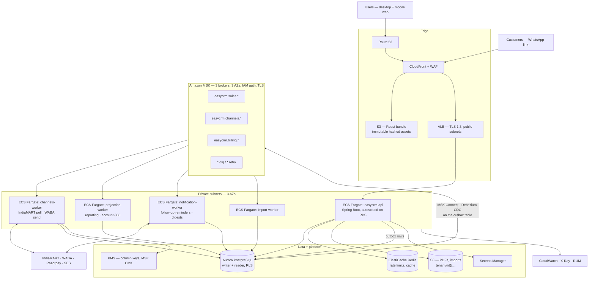

# EasyCRM — Interview Brief: Engineering Challenges + AWS / MSK Deployment

**Purpose.** Interview-facing narrative for the **completed** EasyCRM, in the variant where
**Kafka (Amazon MSK) is part of the architecture**. Three parts:

- **Part A** — backend / Spring Boot challenges and how they were handled
- **Part B** — React / frontend challenges and how they were handled
- **Part C** — AWS deployment with MSK, and the Kafka-specific problems it creates

**Read this first — how this doc relates to the others.**

| Doc | What it is |
|---|---|
| `2026-07-29-target-architecture.md` | The system at completion: **modular monolith, one Postgres, no broker** |
| `interview-qa.md` | Deep Q&A on that architecture (Q1–Q8) |
| `../superpowers/engineering-challenges.md` | 30 challenges actually hit while building the backend |
| **this doc** | Those challenges distilled for interview delivery, **plus** the Kafka/MSK variant |

The repo's own architecture docs argue *against* a broker: synchronous same-transaction Spring
events, a transactional outbox for third-party calls, and "microservices are an extraction seam we
haven't taken." **This doc describes the version where that seam has been taken.** Part C states
plainly what Kafka buys, what it costs, and where I would still refuse to put it — which is a
stronger interview position than "we used Kafka because it scales."

Backend items in Part A are real: each maps to a numbered entry in the challenge log, cited as
`[#n]`. Part B describes the frontend architecture's design decisions.

---

# Part A — Backend / Spring Boot challenges

Eight items. **Lead with A1** (it is the architecture) and **A2** (it is the least guessable).

## A1 — Multi-tenant isolation that a developer cannot forget `[#1, #6, #8]`

**The problem.** Shared-schema multi-tenancy: every tenant's rows sit side by side in `quotation`,
`customer`, `sales_order`, distinguished only by `tenant_id`. One query that forgets its filter
leaks one distributor's pipeline to a competitor. For a CRM, one such leak ends the business — so
"every developer remembers to write `WHERE tenant_id = ?`" is not an acceptable control. Every
single mechanism has its own bypass: application filters get forgotten, ORM filters miss native
SQL, and any single check is a single point of failure for code written next year.

**What I did — four independent layers, each closing a different bypass.**

| Layer | Closes |
|---|---|
| Tenant from the **signed JWT only** → `TenantContext` ThreadLocal, cleared in `finally` | A client choosing its own tenant via header/param/subdomain |
| Hibernate **`@TenantId`** + `CurrentTenantIdentifierResolver` | A developer *forgetting* the filter — they never write it |
| Postgres **RLS**: `USING (tenant_id = NULLIF(current_setting('app.current_tenant', true), '')::uuid)`; app role has no `BYPASSRLS` | Native SQL, reports, scripts, a compromised query |
| **ArchUnit** rule: every `@Entity` declares `@TenantId` unless allowlisted in `GLOBAL_TABLES` | *Future* code — a new unscoped table fails the build |

**The sub-problem worth volunteering: RLS versus a connection pool.** RLS needs to know the current
tenant *on the connection*, but Hikari reuses connections across tenants, so it cannot be set once
at startup. A custom `TenantAwareTransactionManager` issues
`set_config('app.current_tenant', :tid, true)` in `doBegin` — the `true` makes it
**transaction-local**, so it auto-clears at commit/rollback and can never leak into the next
tenant's use of that pooled connection.

**Two things that only real Postgres teaches you.**

1. A **custom GUC that has been referenced defaults to `''`, not NULL** `[#6]`. So
   `current_setting('app.current_tenant', true)::uuid` throws
   `invalid input syntax for type uuid: ""` once the transaction-local setting reverts. Fix:
   `NULLIF(..., '')` before the cast — empty → NULL → `tenant_id = NULL` → zero rows. Related trap
   in the same entry: an RLS `USING` clause **silently doubles as `WITH CHECK`** for writes, so a
   missing tenant blocks *inserts*, not just reads.
2. **RLS fails safe, which is why it fails silently** `[#8]`. `users.findByEmail(...)` returned
   `Optional.empty()` while `findAll()` in the same test returned the row. Cause: Spring Data
   annotates its own concrete methods (`save`, `findAll`, `findById`) `@Transactional`, but **does
   not wrap derived query methods** — so no transaction opened, `doBegin` never ran, the GUC stayed
   `''`, and the policy matched nothing. No error, no leak, just an empty result. Fix:
   `@Transactional(readOnly = true)` on the derived finder so the GUC always exists.

**Proof, not assertion.** Cross-tenant integration test returns **404, not 403** (403 confirms the
record exists). A raw JDBC query with no tenant set returns **zero rows** — proving the *database*
enforces isolation, not the app.

**Lesson.** Security-critical invariants should be **structural, not procedural**. And an isolation
mechanism that fails *safe* fails *silently* — budget for that.

## A2 — You cannot re-tenant an open Hibernate session `[#9, #29]`

This is the one interviewers have not heard before. Two features hit the same wall from opposite
sides.

**The problem, case 1 — signup.** Creating a tenant and its first OWNER user must be atomic, or a
crash leaves a tenant nobody can log into. But the user is tenant-scoped: `@TenantId` fills its
`tenant_id`, and its INSERT must satisfy RLS `WITH CHECK`. At the moment the transaction begins,
**the tenant does not exist yet**. The obvious fix — set the tenant context mid-transaction, right
after the tenant row is created — failed with *"new row violates row-level security policy for
table app_user."*

**Why it's hard.** Hibernate resolves a session's tenant identifier **once, at session-open**, and
never re-reads it. In a `@Transactional` method the session opens at transaction begin — before the
tenant existed — so it froze on the nil `NO_TENANT`. Updating the ThreadLocal and re-issuing
`set_config` afterwards updated the GUC but not the frozen session, so `@TenantId` wrote
`NO_TENANT` while the GUC held the real tenant → `WITH CHECK` mismatch. Made worse by deferred
flush: `save()` only calls `persist()`, so the INSERT and its RLS failure surface at commit, long
after the code that caused them.

**What I did.** Invert it — make the tenant id knowable *before* the transaction. `Tenant` uses an
**application-assigned UUIDv7** generated in its constructor; signup constructs the tenant, sets
`TenantContext`, *then* opens one transaction for both inserts. The session opens already bound to
the right tenant. One consequence to know: a pre-set id makes Spring Data's `save()` take the
merge/UPDATE path, so `Tenant implements Persistable<UUID>` with a transient `isNew` flag cleared on
`@PostPersist`/`@PostLoad` to force a straight INSERT.

**The problem, case 2 — the public share link.** `GET /public/q/{token}` lets a customer open a
quotation PDF from a WhatsApp link with **no login**. No JWT means no tenant, which means every
RLS-scoped query returns zero rows — so a `share_token` column on `quotation_version` would be
**unlookupable by construction**: the column meant to let the request in is the first thing RLS
hides from it.

**What I did.** Move the *resolution* step outside the isolation boundary instead of weakening the
boundary. `share_link` is a deliberately minimal global (RLS-exempt, allowlisted) table whose only
job is `token → (tenant_id, quotation_version_id)`. It holds **no document content** — no buyer
name, no amounts, nothing GST-related — so tenant-less reads of it expose nothing worth protecting.

```
GET /public/q/{token}                     no JWT, no tenant
  → ShareLinkService.resolve(token)        global table, no RLS      → 404 if absent
  → TenantContext.runAs(tenantId, () -> …) tenant installed HERE
      → QuotationPdfService.render(…)      opens its @Transactional now
      → @TenantId + RLS enforce normally from this point on
```

**The ordering is load-bearing, for exactly the reason in case 1.** `runAs` must wrap the call that
opens the transaction. And it only works because **`spring.jpa.open-in-view: false`** — with OSIV
on, Spring opens the `EntityManager` in a servlet filter *before the controller method runs*, the
session freezes on `NO_TENANT`, and installing the real tenant afterwards changes nothing. Failure
mode: total silence, every render empty, nothing in the logs pointing at OSIV.

**Lesson.** Session-open timing is the invariant, and it applies at the controller boundary as much
as the transaction boundary. When a pre-auth endpoint must reach tenant-scoped data, don't make the
scoped table reachable without a tenant — put a content-free resolution table outside the boundary
and install tenancy before anything opens a session.

## A3 — Money is an end-to-end property, not a type choice `[#2, #17]`

**The problem.** `double` is base-2; `0.1`, `0.01` and `18.5` have no exact representation, and the
error compounds across GST line items until **our quote total ≠ the Tally invoice total** — the
precise trust-break the product exists to avoid, since the distributor reconciles against Tally.

**What I did — an exact base-10 decimal at every hop, with a guard per hop.** Breaking the chain
anywhere reintroduces the bug.

| Hop | Type | Guard |
|---|---|---|
| Postgres | `NUMERIC(18,2)` amounts, `NUMERIC(18,4)` rates | never `double precision` |
| JPA entity | `BigDecimal` | ArchUnit rule fails the build on money-as-`double` |
| Arithmetic | `BigDecimal`, String-constructed, explicit-scale divide, `HALF_UP` | never `new BigDecimal(aDouble)` |
| Rounding **point** | per line, then sum | matches Tally exactly |
| JSON wire | **string**, `toPlainString()` | JS numbers are doubles |
| React | string + display formatting only | server recomputes on save |

**Where you round matters as much as the type.** Tally rounds per line then sums, so we do too:
`taxable = round(qty × rate − discount, 2)`, `gst = round(taxable × rate / 100, 2)`,
`total = Σ lineTotal`. Not "sum raw then round once" — that drifts a rupee. CGST and SGST are each
rounded independently, matching Tally's two half-rate lines.

**The wire is the sneaky part.** Every JavaScript number is a `double`, so serializing money as a
JSON *number* lets `JSON.parse` reintroduce the error we just removed. Implementation detail worth
citing `[#17]`: on **Spring Boot 4 / Jackson 3** the serializer API moved wholesale from
`com.fasterxml.jackson.*` to **`tools.jackson.*`** — it is `ValueSerializer<T>` with a
`SerializationContext`, not `JsonSerializer` with a `SerializerProvider`, so no Jackson-2 tutorial
applies. Registered **once, globally**, as a `JacksonModule` `@Bean` that Boot's auto-config picks
up, rather than per-DTO annotations — the only way the fix covers money fields written *before* it
existed.

**One authoritative computation.** The browser preview is allowed to be wrong; the stored, PDF'd and
WhatsApped figure is always the server's. `BigDecimal.equals` is scale-sensitive
(`"18".equals("18.0")` is `false`), so every value comparison uses `compareTo` `[#14]` — a
GST-slab check written with `Set.contains` silently rejects a rate that arrived from a form as
`18.0`.

## A4 — Gapless document numbering, and why not a sequence `[#16]`

**The problem.** `QT/25-26/0001` must be gapless per tenant per financial year. A distributor who
sees `0037` then `0039` assumes a lost document and calls support. Three obvious approaches all
fail:

- A Postgres **`SEQUENCE`** doesn't reset per FY or per tenant without one sequence object per
  `(tenant, FY, doc_type)` — unbounded DB objects — and a rolled-back transaction **permanently
  burns** the value it fetched. Sequences are non-transactional *by design*; that's what makes them
  fast, and it's the exact opposite of what "no gaps" needs.
- **`SELECT` then `UPDATE`** lets two concurrent sends read the same `next_val` and format the same
  number — a duplicate, which is worse than a gap.
- **`@Version`** avoids the duplicate but turns the second sender into a retry path, for a row
  contended for microseconds.

**What I did.** One row per `(tenant_id, doc_type, fy)` in `document_counter`, read with
`@Lock(PESSIMISTIC_WRITE)` → `SELECT … FOR UPDATE`, and — the load-bearing part — `nextQuoteNo` is
`@Transactional` with default `REQUIRED` propagation, so **the lock is held and released by the
caller's transaction**. Both properties then fall out of the transaction boundary for free:

- **Gapless under concurrency** — a second sender blocks on the row lock until the first commits.
- **Rollback burns nothing** — if the send fails downstream (PDF render, validation), the increment
  rolls back with it and the *same* number goes to the next successful send. Tested directly:
  `TransactionTemplate` → `nextQuoteNo` → `setRollbackOnly()` → assert the next call reuses `0001`.

Honest limits I'd volunteer: this serializes issuance per tenant per doc type — a throughput ceiling
accepted knowingly, because a distributor issues tens of orders a day. And one residual race exists
on the coldest path: two concurrent *first-ever* sends for a new `(tenant, doc_type, fy)` both try
to insert the counter row; the loser gets a transient 409 and succeeds on retry.

**Related bug worth telling, because it shows state-machine testing** `[#19]`. `send()`
unconditionally assigned a quote number. Correct the first time — but `revise()` deliberately sets
status back to `DRAFT` while *keeping* `quote_no`, so re-sending a revised draft pulled a fresh
number and overwrote the one the customer had already seen. Every test passed, because they all ran
`create → send`, never `create → send → revise → send`. Fix: guard on absence
(`if (quoteNo == null)`), not on which endpoint you're in. **Write-once fields need "is it already
set?", and invariants need testing across the full cycle, including re-entering a state.**

## A5 — Four kinds of idempotency, and picking the weakest sufficient one `[#3, #21, #26, #27]`

**The problem.** The target users are on tier-2 Indian 4G with unreliable power. "No acknowledgement
arrived, so I'll tap again" is *correct user behaviour*, and it must never produce two orders for
one quotation.

**What I did — separate the two failure windows, then use the cheapest tool for each.** `[#3]`

| Crash moment | Order saved? | Retry does | Safe because |
|---|---|---|---|
| **Before commit** | No | creates it fresh | transaction **atomicity** |
| **After commit, ack lost** | Yes | returns the **same** order | **idempotency** |

Spring's `ApplicationEventPublisher` is synchronous and same-transaction by default, and I kept it
that way deliberately: accepting the quotation, creating the order and logging the activity commit
or roll back **together**. That turns "in-memory events aren't durable" from a bug into a non-issue
— the event never outlives its transaction, so there is nothing to redeliver.

**Then the sharper decision** `[#21]`. The generic answer to the second window is a client-generated
`Idempotency-Key` in its own table. For *accept*, that's more machinery than the domain needs,
because **a quotation can only ever produce one order** — a domain invariant, so it's a free
idempotency key:

1. `UNIQUE(tenant_id, quotation_id)` on `sales_order` — the DB physically cannot hold two.
2. A status check at the top of `accept()`: already `ACCEPTED` → return the existing order,
   untouched. That's the fast common path.
3. A raced double-tap is caught by the quotation's `@Version` (loser's UPDATE matches zero rows) or,
   failing that, by the unique constraint.

The client-key table stays reserved for actions with **no** natural one-to-one identity.

**The trap in the exception hierarchy** `[#26]`. A global
`@ExceptionHandler(DataIntegrityViolationException)` → 409 does **not** cover optimistic-lock
losers. `ObjectOptimisticLockingFailureException` sits in a disjoint branch of the
`DataAccessException` tree (`OptimisticLockingFailureException` → `ConcurrencyFailureException` →
**Transient**DataAccessException, versus **NonTransient**DataAccessException). So the race-loser fell
through to a raw **500** — even though integrity was perfectly intact and exactly one writer won.
Two places relied on `@Version` and both would 500 their losers. Fix: a **sibling** handler on
Spring's base `OptimisticLockingFailureException` → 409 "concurrent update, please retry."
**Adding a `@Version` field silently creates a second exception subtree you must map.**

**And idempotency is a claim about a result, not a status code** `[#27]`. Adding `CANCELLED` to
`Order` broke accept's idempotent branch invisibly: it kept returning **200 with a dead order**,
because the unique constraint means the cancelled row still occupies the only slot. Nothing failed
loudly — the contract just stopped being true. Fix: accept's idempotent branch checks for
`CANCELLED` and returns **422** "raise a new quotation." When you add a terminal state, re-read
every idempotent path that hands that aggregate back.

## A6 — Two coupled writes must share one transaction `[#25, #18, #22]`

**The problem.** Raising a quotation *from a lead* does two writes: flip the `Enquiry` to
`CONVERTED` and stamp its id on the new `Quotation`. The inviting shape is a dedicated
`POST /enquiries/{id}/convert` — which puts the flip and the quote build in **different
transactions**. Quote creation can still fail its own validation afterwards (a bad line item, a
price-resolution miss), leaving a `CONVERTED` lead — terminal, un-editable, and *dropped out of the
one-active-enquiry-per-phone partial index* — with no quotation behind it. A transient validation
error traded for a permanent bad state.

**What I did.** No new endpoint and no second transaction. `QuotationCreateRequest` already carried
a nullable `enquiryId`, so conversion is a few lines *inside* `QuotationService.create()`'s existing
`@Transactional` method. Any downstream failure rolls the flip back with everything else — proven by
a test that fires a valid `enquiryId` with an invalid item, expects 422, then asserts the enquiry is
still `NEW`. Two guarantees fall out of the same placement: one enquiry converts once (the entity's
own terminal guard), and concurrent double-convert is caught by `@Version`.

**Two related invariants in the same aggregate.**

- **Mutable-DRAFT / frozen-SENT** `[#18]`. The spec calls a `quotation_version` an "immutable
  snapshot" *and* requires traders to revise 3–4 times before sending — contradictory read
  literally. Resolution: immutability is a function of **lifecycle state**, not of the row. A
  version is mutable only while its parent is `DRAFT`; every write path funnels through one
  `requireDraft` guard; `send` flips status **and** `markSent()` in one transaction so they can never
  disagree; revising a `SENT` quote **copies** the frozen items into a new `DRAFT` version rather
  than unfreezing anything.
- **An event is a side-effect seam, not a return channel** `[#22]`. The spec's wording ("the order
  handler subscribes to quotation-accepted") read literally makes the event *produce* the order —
  which means the HTTP response has nothing to return until a listener has run, re-coupling the
  publisher to a specific subscriber. So `accept()` creates the order **inline** and *then* publishes
  `QuotationAcceptedEvent` carrying everything a subscriber could need. Audit attaches today;
  activity-log and WhatsApp attach later without `QuotationService` ever knowing they exist. **Events
  for "notify that this happened"; direct calls for "produce the value my caller needs now."**

## A7 — Constraints that are conditional on state `[#23, #15]`

**The problem.** "A phone number may have at most one *active* enquiry, but a returning customer may
enquire again once the previous one is `CONVERTED` or `LOST`." A plain
`UNIQUE(tenant_id, normalized_phone)` is too strong — it permanently blocks re-enquiry. The usual
pattern (app pre-check + always-on unique constraint) doesn't fit either, because the constraint
needs to *stop applying* once the row goes terminal, and an ordinary constraint has no notion of row
state.

**What I did.** A **partial unique index**:

```sql
CREATE UNIQUE INDEX ... ON enquiry (tenant_id, normalized_phone)
  WHERE stage NOT IN ('CONVERTED', 'LOST');
```

Postgres enforces uniqueness only among rows satisfying the predicate, so a row silently leaves the
constraint's scope the moment `stage` is updated — no cleanup job, no soft-delete flag, and the
invariant stays **atomic with the state transition itself** (updating `stage` is what frees the
slot, same row, no second write). Verified by asserting a second active insert throws, then succeeds
once the first is moved to `LOST`.

**The general pattern behind it** `[#15]`. A service-layer "does this already exist?" check is a UX
nicety, not a correctness guarantee — it's a check-then-act race. Only the DB constraint is atomic
with the insert. So: **pre-check for the friendly field-attributed 409, constrain always for
correctness, and translate the violation centrally** in one `@ControllerAdvice` rather than
try/catch at every write site.

## A8 — The toolchain lies to you on a new major version `[#4, #7, #10, #5, #30]`

Worth 60 seconds in an interview because it's about *how you debug*, not what you know.

- **Spring Boot 4 split its auto-configurations out of the monolithic `spring-boot-autoconfigure`
  jar** `[#4]`. `flyway-core` on the classpath no longer brings `FlywayAutoConfiguration`, so
  **Flyway silently never ran** — and the symptom was
  `FATAL: password authentication failed for user "easycrm_app"`, because the migration that creates
  that role never executed. Two red herrings: Postgres `scram-sha-256` returns "password
  authentication failed" for a **non-existent** role too (deliberately, to prevent username
  enumeration), and the surface error was a Hibernate "Unable to determine Dialect." The tell was
  **zero Flyway lines** in a full startup log. Fix: depend on `spring-boot-starter-flyway`.
- **Jackson 3 moved its base package** to `tools.jackson.*` `[#10]`, so imports "do not exist" while
  JSON serialization plainly works at runtime. When that happens, suspect a package/coordinate
  rename before anything else — `./gradlew dependencies` shows the truth.
- **ArchUnit 1.3 couldn't parse Java 25 bytecode** and silently imported **zero** classes `[#7]`, so
  every architecture rule evaluated against an empty set. Only ArchUnit's own `failOnEmptyShould`
  safeguard caught it. Lesson: **always confirm an architecture rule fails on a known-bad input** —
  I added a deliberately unscoped entity, watched the build go red, then deleted it.
- **The version of that lesson I'm proudest of** `[#30]`. The cross-tenant test on the public share
  endpoint asserted tenant B's data never appears in a PDF rendered from tenant A's token. It
  passed. **It would have passed with `@TenantId` and the RLS policies deleted**, because the token
  could only ever resolve to A's data — B's row was never on the other end of the lookup, so its
  absence proved nothing. Fix: **forge the adversarial state directly** — write a `ShareLink` row
  straight through the repository with `tenantId` = B and `quotationVersionId` = A's version, a row
  no production path can create, and assert 404. The original test was kept, renamed to say what it
  actually proves. **An absence assertion is only meaningful if there's a concrete path by which the
  thing could have arrived** — and isolation layers, by construction, never manufacture that path
  themselves.
- **Testcontainers**: `@Container static` scopes a container **per test class** `[#5]`. Several
  integration classes meant several Postgres containers, and on macOS Docker Desktop a hanging
  `docker-credential-desktop` helper (30s timeout) made one unreachable — passing individually,
  failing as a suite. Fix: singleton container on a shared base class + Spring's test-context
  caching. Suite went from ~1 minute to ~4 seconds. **Faster tests are more reliable tests** — less
  time in flight is fewer chances to hit a transient daemon hiccup.

---

# Part B — React / frontend challenges

The frontend is Vite + React + TypeScript, TanStack Query for server state, Zustand for session and
UI prefs only, React Hook Form + Zod, TanStack Table, shadcn/ui + Tailwind, react-i18next.

**The constraint that drives every decision: tier-2/3 Indian mobile networks are the target profile,
not the edge case.** A 2 MB app that's fine in a Bangalore office is unusable in Rajkot. "Works on my
machine" is a literal description of the failure.

## B1 — Almost nothing here is client state

**The problem.** The instinct is a global store holding enquiries, quotations, customers. But those
live on the server; **every browser copy is a cache**, and calling it a store hides the questions
that actually matter: when is it stale, how do we revalidate, what happens on refocus, how do we
dedupe two components asking for the same key at once, how do we invalidate after a mutation.

**What I did.** TanStack Query owns all server state and answers those five questions as
configuration rather than code. Zustand holds only the auth session and UI preferences. Redux was
rejected specifically because it makes you hand-roll caching, deduping and revalidation and get each
subtly wrong.

Supporting decisions: a **query-key factory** (`qk.quotations.detail(id)`) so keys are typo-proof and
in one file; `staleTime` **per resource** (the product catalog is stable for minutes, follow-ups are
not); `keepPreviousData` so pagination swaps without a loading flash; prefetch on hover for
list→detail; and **cursor pagination matching the backend**, so page 500 costs what page 1 costs
instead of making Postgres materialize and discard 10,000 rows.

**The most common "bug" this creates** is a stale read after a mutation forgot to invalidate a key —
two seconds to spot in the Query Devtools, which is why that's the first tool I reach for.

## B2 — Types are generated, and money is a string in the type system

**The problem.** A hand-written `QuotationResponse` interface is a lie waiting to happen: the
backend renames a field, TypeScript still compiles, you find out in production. Worse, the natural
TypeScript type for `grandTotal` is `number` — and **every JavaScript number is an IEEE-754
double**, which would undo A3's entire chain at the last hop.

**What I did.** springdoc → OpenAPI → `openapi-typescript`, with **CI failing on drift**. Because
Jackson serializes `BigDecimal` as a JSON string, the generated type says `string`, so **nobody can
do float arithmetic on rupees without the compiler stopping them.** The type system enforces the
same discipline `BigDecimal` and `NUMERIC` enforce server-side. Money is formatted for display only
(`toLocaleString('en-IN')`) and never computed on.

**The mirrored rule.** The quotation builder shows live client-side totals for responsiveness, and
**the server response overwrites them on save, always** — exactly as `QuotationService.buildItems`
behaves. The preview is allowed to be wrong; the saved figure never is.

## B3 — The quotation builder: 30 line items, one re-render per keystroke

**The problem.** The builder is the screen that decides the product: keyboard-first, Tab through
lines, `Enter` adds a row, type-ahead product lookup, rate auto-filled from the customer's price
list and overridable. It's a nested `useFieldArray` — and the naive implementation re-renders all 30
rows **on every keystroke**, because each row's value change bubbles a state update through the
array. Per-keystroke jank destroys a keyboard-first workflow completely; the trader goes back to
Excel.

**What I did.**

- **Uncontrolled inputs via React Hook Form** — values live in refs, so typing does not trigger a
  React render at all. This is the single biggest win and it's architectural, not an optimization
  pass.
- **Memoized row components** keyed by field id, so adding or removing a line re-renders one row,
  not the array.
- **Debounced totals** — the GST recompute for the preview runs on a trailing debounce rather than
  per character.
- **Watch narrowly.** `watch()` over the whole form subscribes the parent to every change and undoes
  the above; subscribe to the specific fields the total depends on.

**Lesson.** Reach for the *uncontrolled* form model before reaching for memoization. Memoizing a
controlled 30-row array is fighting a design decision instead of changing it.

## B4 — 3,000 editable rows in the import preview

**The problem.** The import wizard's whole value is *preview before commit*: parse a dirty
distributor CSV, show every row with its validation errors, let the user fix cells inline, then
commit. 3,000 rendered `<input>` elements lock a mid-range Android outright. **Virtualization here
is a correctness requirement, not a performance nicety.**

**What I did.** TanStack Table + row virtualization: only the ~30 visible rows are in the DOM. Then
the three problems virtualization *creates*, which is the part worth discussing:

1. **Errors on unrendered rows are invisible.** Virtualizing means "row 2,847 has an invalid GSTIN"
   exists in state but not in the DOM. So the error summary is a **separate, always-rendered
   component** built from validation state, with "jump to row" doing a programmatic
   `scrollToIndex` — errors are navigable independently of what's painted.
2. **Edit state must live outside the row.** A virtualized row unmounts when scrolled away, so any
   state held *in* it is lost. Edits go into form state keyed by row id, and the row component is a
   pure projection of that.
3. **Ctrl+F stops working**, and so does "select all rows." Both need explicit UI (a filter box, a
   select-all that operates on state rather than on rendered checkboxes) because the browser can only
   see 30 rows.

**Wizard state** is an explicit state machine — `upload → map → preview → commit` — mirroring the
backend's `ImportBatch` states, so the frontend and backend agree on what "step 3 failed" means.

## B5 — The 401 refresh stampede

**The problem.** The access token is held **in memory** (not `localStorage` — that's XSS-readable),
the refresh token in an `httpOnly`/`Secure`/`SameSite` cookie. When the access token expires, a
dashboard loading six panels fires six requests that all 401 **simultaneously**. Six independent
refresh attempts follow; the first rotates the refresh token, and the other five fail against a
token that no longer exists → the user is logged out at random, mid-task, on a flaky connection.
It's intermittent, so it reads as "the app randomly logs me out."

**What I did.** Single-flight refresh in the API client. The first 401 starts **exactly one**
refresh and stores the in-flight promise. Every concurrent 401 **awaits that same promise** rather
than starting its own, then retries its original request with the new token. If the refresh itself
fails, all queued requests reject together and the client hard-logs-out **once** — a single clean
redirect instead of six racing ones.

Adjacent detail: the refresh call must be excluded from the interceptor that triggers refresh, or a
failing refresh recurses.

## B6 — Optimistic updates, and what a 409 actually means to a user

**The problem.** Optimistic mutation is table stakes for perceived speed on slow 4G — apply the
change locally, fire the request, roll back on error. But the backend's concurrency design (A5)
means a rejection can be a **409 from an optimistic-lock loss**, and rolling back silently is
wrong: the user's edit is gone and they don't know why, or worse, they retry into the same conflict.

**What I did.** The mutation is a command with an explicit rollback: snapshot the cache entry, apply
the optimistic patch, and on error restore the snapshot **and** surface a typed error. The
generated client normalizes the backend's RFC 7807 `ProblemDetail` into typed errors, so a 409 maps
to a specific message — *"someone else changed this quotation; reloading the latest"* — plus an
automatic invalidate of that key, rather than a generic red toast. A 422 (validation) maps to
field-level errors on the form; a 402 (`PLAN_LIMIT_EXCEEDED`) maps to an upgrade card showing
`used / limit`.

**Lesson.** Optimistic UI is only half the feature. The other half is a **taxonomy of failures** the
UI can act on differently, which is why the backend's one-global-`ProblemDetail`-handler decision
pays off on the client.

## B7 — A 200 KB budget, and Devanagari

**The problem.** Two independent ways to blow a slow-4G budget:

1. Bundle creep. Regressions arrive one 40 KB dependency at a time, and nobody reads a size report.
2. **Hindi means Devanagari**, and full Noto Sans Devanagari is heavy. Ship it globally and every
   English-only user pays ~300 KB for glyphs they never render.

**What I did.** Route-level `React.lazy` code splitting, a split vendor chunk, and a size budget
that **fails the build** rather than printing a warning. **No barrel files** — `index.ts` re-exports
break tree-shaking, which is material at a 200 KB budget. CI runs Lighthouse on a **throttled Slow
4G profile**, because a Lighthouse pass on office fibre proves nothing about a Rajkot warehouse.
Devanagari is **subset** and loaded only for the Hindi locale.

That last one is the same underlying problem as the backend's PDF font: Indian scripts need real
coverage, and getting it wrong means `#` glyphs in one place and a 300 KB download in the other.

## B8 — Debugging across the stack, and the test that matters most

**Debugging.** Every response carries `X-Trace-Id`, including errors, and the UI error toast shows
it. Paste it into CloudWatch Logs Insights and you have the backend logs and X-Ray trace for that
exact request. "Sending fails sometimes" becomes a lookup instead of archaeology. Error boundaries
are **per route**, so one broken panel doesn't white-screen the app, and they report to RUM **with
the trace id** — a white-screen leaves a diagnosable record instead of silence.

Order of tools: Query Devtools (is it a cache problem?) → React Profiler (is it a render problem?)
→ Network tab (slow API, or a request *waterfall* — waterfalls are more common and more fixable) →
Playwright trace viewer for CI-only flakes. Same discipline as backend debugging: **localize the
layer before forming a theory.**

**Testing.** Vitest + Testing Library + **MSW** — mocking at the network layer, not by stubbing
hooks, so tests exercise the real Query cache behaviour that B1 depends on. Playwright on four
paths: login; enquiry → quote → send; the import wizard on a deliberately dirty CSV; and **the
cross-tenant 404** — an E2E assertion from the browser, on every commit, that tenant A cannot reach
tenant B's quotation. Four isolation layers are only as good as the proof they still hold, and
`[#30]` is why that test is written to be capable of failing.

---

# Part C — AWS deployment with Amazon MSK

## C1 — Topology



**Everything stateful is private.** Only CloudFront and the ALB are public. Fargate tasks sit in
private subnets with no public IPs; egress to Meta/IndiaMART/Razorpay goes through a NAT Gateway;
S3, KMS, Secrets Manager and ECR are reached over **VPC endpoints** (cheaper than NAT and the
traffic never leaves the AWS network).

**Why the request path is still a monolith.** `easycrm-api` remains one deployable serving
`/api/v1`. The workers are the modules whose *runtime profile* differs from a web request — long
third-party calls, chunked imports, scheduled sweeps, projection rebuilds. The ArchUnit rule that
`sales` may call a `catalog` **service interface** but never its repository or entity is the seam
that made pulling them out cheap. **Kafka is the transport between those pieces, not a replacement
for local transactions.**

## C2 — What actually goes through Kafka, and what deliberately does not

This is the question that separates "we used Kafka" from "we understood Kafka."

**Through Kafka — work that must survive a crash and has no caller waiting:**

| Topic (v1) | Producer | Consumers |
|---|---|---|
| `easycrm.sales.quotation-sent` | api | notification (WABA send), projection |
| `easycrm.sales.quotation-accepted` | api | notification, projection, billing (metering), tally-feed |
| `easycrm.sales.order-status-changed` | api | notification, projection, tally-feed |
| `easycrm.sales.enquiry-created` | api, channels | notification (first-contact follow-up), projection |
| `easycrm.channels.message-inbound` | channels (webhook receiver) | sales (activity log), notification |
| `easycrm.billing.subscription-changed` | api (webhook receiver) | entitlement materializer, notification |

**Not through Kafka — anything a user is waiting on.** Accepting a quotation still creates the order
**inline, in one local Postgres transaction** (A5). Publishing the accepted event is a side effect
of that transaction, not the mechanism that produces the order. If I routed order creation through
Kafka I would have converted an atomic local transaction into a distributed one needing a saga and
compensating actions — **microservice cost without microservice ownership**, and the user would
stare at a spinner waiting for a consumer to catch up.

**The rule I'd state in one line:** Kafka carries *"this happened, react to it"*; it never carries
*"do this and tell me the answer."*

## C3 — The dual-write problem, and the outbox

**This is the single most important thing to say.** The naive producer is:

```java
@Transactional
public OrderResponse accept(UUID id) {
    Order order = ...;          // Postgres
    orders.save(order);
    kafka.send("quotation-accepted", event);   // ← NOT in the transaction
}
```

There is **no atomicity across Postgres and Kafka.** Two failure modes, both silent:

- The commit succeeds and the `send` fails (or the pod dies in between) → the order exists, no
  WhatsApp message is ever sent, no follow-up is created, reporting never sees it.
- The `send` succeeds and the transaction rolls back → downstream systems act on an order that does
  not exist. Worse than losing the event: the customer gets a confirmation for a phantom order.

Moving `send` before the commit doesn't help; it inverts which failure you get. Wrapping both in a
distributed transaction (XA) means an unavailable broker blocks Postgres commits, which is worse
than the problem.

**What I did — transactional outbox, then CDC into Kafka.**

1. The business transaction writes the domain rows **and** an `outbox_event` row in the **same local
   transaction**. Atomic, by definition — one database, one commit. If the transaction rolls back,
   the event was never recorded.
2. **Debezium on MSK Connect** tails Postgres's WAL for inserts on `outbox_event` and publishes to
   the topic named by the row's `aggregate_type`. No polling, no missed rows, and events reach Kafka
   in **commit order**.

```sql
CREATE TABLE outbox_event (
  id             uuid PRIMARY KEY,          -- UUIDv7: also the dedupe key downstream
  tenant_id      uuid        NOT NULL,      -- carried into the envelope, NOT for RLS on this table
  aggregate_type text        NOT NULL,      -- → topic
  aggregate_id   uuid        NOT NULL,      -- → partition key
  event_type     text        NOT NULL,
  schema_version int         NOT NULL,
  payload        jsonb       NOT NULL,      -- identifiers only; see C6
  trace_id       text,                      -- propagated so the consumer span links to the click
  created_at     timestamptz NOT NULL DEFAULT now()
);
```

**Why Debezium rather than a polling publisher.** A poller is simpler and needs no Connect cluster,
but it adds latency (poll interval), needs `FOR UPDATE SKIP LOCKED` to be multi-instance safe, and —
the subtle one — a poller ordering by `created_at` can **miss rows**: a transaction that started
earlier but committed later gets a lower timestamp than rows already published. WAL order is commit
order, so CDC sidesteps that class of bug entirely. Cost: MSK Connect is another component to run
and monitor, and `wal_level = logical` plus a replication slot on Aurora that **must be monitored**
— a stalled connector means the slot pins WAL and the writer's storage grows until it doesn't.

**Delivery semantics, stated honestly.** Outbox + CDC is **at-least-once**, not exactly-once. A
connector restart can re-publish. That's fine, because every consumer is idempotent (C5) — and it's
the same conclusion the codebase already reached three times over for IndiaMART
`provider_message_id`, WABA `wamid` and Razorpay `event_id`: **one inbox mechanism, now a fourth
producer feeding it.**

## C4 — Topics, keys, and the multi-tenant partitioning trap

**Naming:** `easycrm.<module>.<event>.v<n>` — module-scoped so ownership is obvious, versioned in
the name so a breaking change is a new topic rather than a coordinated big-bang deploy.

**Partition key = `aggregate_id`, not `tenant_id`.** This is the decision I'd expect to be pushed
on, so here's the reasoning:

- Kafka guarantees ordering **only within a partition**. Keying by `aggregate_id` (the quotation or
  order UUID) means every event for one order arrives in order — which is the ordering that actually
  matters, because `CONFIRMED → PACKED → DISPATCHED` for order X must not be reordered.
- Keying by `tenant_id` would give per-tenant total ordering, which sounds appealing and is a trap:
  **tenant skew is extreme in this product.** One distributor may have 400k enquiries while 900 have
  300 each. That whale becomes a **hot partition** — one consumer thread does most of the work, lag
  is unevenly distributed, and adding consumers doesn't help because a partition has exactly one
  consumer per group. It's the same skew that breaks the Postgres planner for that tenant.
- **Never a topic (or partition) per tenant.** Partitions are a broker-level resource with hard
  limits, and metadata/leader-election cost scales with partition count. A thousand tenants × six
  event types would be architectural malpractice. **Tenancy is data in the message, not topology.**

**Sizing:** modest partition counts (6–12 per topic) chosen from *target consumer parallelism*, not
from message volume, since partition count is the ceiling on consumers per group and is awkward to
increase later (increasing it **rehashes keys**, so a key that used to live in partition 2 may move
— which breaks the per-key ordering guarantee across the change).

**Retention:** 7 days on domain-event topics — long enough to replay through a bad weekend, short
enough that it isn't a shadow database. Reporting projections are rebuildable by replaying a
consumer group from the earliest offset, which is the concrete argument for Kafka over SQS here: SQS
messages are consumed and gone.

## C5 — Consumers: the four things that go wrong

**1. Tenant context does not exist on a consumer thread.** There is no JWT, no `TenantContext`, and
therefore RLS sees `''` and returns zero rows for everything — silently, exactly as in `[#8]`. So
the tenant id travels in the **event envelope** (message header + payload), and every consumer's
first act is:

```java
@KafkaListener(topics = "easycrm.sales.quotation-accepted", groupId = "notification-worker")
public void on(ConsumerRecord<String, EventEnvelope> rec, Acknowledgment ack) {
    var e = rec.value();
    if (!inbox.claim(e.eventId())) { ack.acknowledge(); return; }   // idempotency, C5.2
    MDC.put("tenantId", e.tenantId()); MDC.put("traceId", e.traceId());
    try   { TenantContext.runAs(e.tenantId(), () -> handler.handle(e)); ack.acknowledge(); }
    finally { MDC.clear(); }                                        // pooled threads must not leak
}
```

`runAs` **before** anything opens a transaction — the same session-open ordering constraint as A2,
now on a consumer thread instead of a controller. And `MDC.clear()` in `finally`, because a leaked
tenant id labels tenant A's log lines with tenant B.

**2. Idempotency, because delivery is at-least-once.** Rebalances, redeliveries and connector
restarts all replay. Every consumer claims the `event_id` in an inbox table with
`ON CONFLICT DO NOTHING` and processes only if the insert inserted — the identical mechanism already
used for three third-party integrations. **Offsets are committed manually, after successful
processing**, never with `enable.auto.commit`, which acknowledges on poll and loses messages on a
crash mid-handler.

**3. Poison messages and the retry/DLQ ladder.** A message that always throws will, with naive
infinite retry, block its partition forever — head-of-line blocking that stalls every later message
for every tenant on that partition. So: bounded in-process retry for transient failures, then
publish to `<topic>.retry` with a backoff delay, then to `<topic>.dlq` after N attempts, and commit
the offset so the partition moves on. **The DLQ needs an alarm and a human**, or it's just a place
messages go to be forgotten. And retry only what's retryable — WABA's `131026` ("not a WhatsApp
user") is permanent, and blind-retrying it burns the tenant's quality rating.

**4. `max.poll.interval.ms` and the rebalance storm.** Kafka assumes a consumer that hasn't polled
within `max.poll.interval.ms` (default 5 min) is dead and triggers a **rebalance** — which revokes
partitions, so the work in flight is re-delivered elsewhere, which makes the next consumer slow too.
The failure cascades. Two of these consumers do genuinely slow work — a WABA send with a media
upload, a PDF render. Fixes: keep `max.poll.records` small (a batch of 500 records × 2s each blows
any interval), do the slow I/O off the poll thread with the listener acknowledging on completion, and
**never hold a DB transaction across a third-party HTTP call** — the same rule the outbox and the
`SKIP LOCKED` poller already follow.

**Scaling signal.** Consumers autoscale on **`SumOffsetLag` from CloudWatch**, not CPU — a consumer
blocked on WABA latency has flat CPU and growing lag, and lag is the metric that means "customers are
waiting." Concurrency per service is capped at its topic's partition count; beyond that, extra tasks
idle.

## C6 — Security, tenancy and DPDP on the wire

| Concern | Control |
|---|---|
| Broker auth | **MSK IAM authentication** — no static SASL passwords to rotate or leak; producers/consumers authorize via task-role IAM policy scoped to specific topics and consumer groups |
| Network | Brokers in private subnets; security group ingress only from the ECS task SGs. No public endpoint |
| In transit | TLS 1.2+ enforced, in-cluster encryption on |
| At rest | Encrypted with a **customer-managed KMS CMK** (the same key management story as the AES-GCM column encryption for IndiaMART/WABA credentials) |
| Authorization granularity | One consumer group per worker; IAM policy grants `WriteData` on the topics it produces and `ReadData` + `AlterGroup` only on what it consumes. A compromised import worker cannot read billing events |

**The event payload carries identifiers, not entities.** `quotation-accepted` carries
`{tenantId, quotationId, quotationVersionId, orderId, orderNo, grandTotal, actorUserId}` — no buyer
name, no phone number, no GSTIN, no line items. Three reasons, and the third is the one people miss:

1. It's the same rule as the logging denylist — **log the identifier, not the entity.**
2. Consumers re-read from Postgres under `runAs`, so they get RLS-enforced current data instead of a
   stale copy that bypassed the isolation layers.
3. **DPDP right-to-erasure.** A Kafka topic is an append-only log; you cannot surgically delete one
   person's data from it. If PII lived in events, honouring a deletion request would mean log
   compaction gymnastics or waiting out retention. With identifier-only payloads, **erasure stays a
   Postgres concern** and Kafka holds nothing that needs erasing. Same reason the audit log lives in
   Postgres rather than in CloudWatch: legally-retained records must not be governed by log
   retention.

**Schema evolution:** **AWS Glue Schema Registry** with **backward compatibility** enforced at
registration, so a producer physically cannot ship a change that breaks live consumers. New fields
are optional with defaults; a genuinely breaking change gets `.v2` and a dual-publish window. And
the deploy order matters: **consumers first for additive changes**, producers first never.

## C7 — Deployment mechanics

**Pipeline.** GitHub Actions → Gradle build + the full Testcontainers suite + ArchUnit → build image
→ push to **ECR with an immutable tag** (the git SHA — `latest` is unrollbackable) → Terraform plan →
apply. The frontend builds separately to S3 with hashed asset names and a CloudFront invalidation of
`index.html` only.

**Migrations are their own step, and they're expand/contract.** Flyway runs as a **one-shot ECS task
before the rolling deploy**, not from application startup — Boot's `spring.flyway.enabled=false` in
production. Two reasons: N tasks starting simultaneously would race on the migration (Flyway locks,
but the first-boot failure mode is ugly), and a failed migration should fail the *deploy*, not leave
half a fleet crash-looping. Because ECS rolling deploys run **old and new tasks concurrently**,
every migration must be backward compatible with the previous image: add columns nullable, backfill,
switch reads, drop in a *later* release. A `NOT NULL` column added in the same deploy as the code
that writes it breaks every old task still serving traffic.

**Rollout.** ECS rolling update with **deployment circuit breaker + automatic rollback**, health
checks on `/actuator/health/readiness`. **Readiness must not check third parties** — failing it
deregisters the target, which would turn a Razorpay outage into a total outage of ours. Consumers
need one extra consideration: a rolling deploy triggers a **rebalance** per task replacement, so
cooperative sticky assignment (`CooperativeStickyAssignor`) keeps that from being a stop-the-world
event across the group.

**Config and secrets.** No secrets in task definitions or env vars in plaintext: `secrets` blocks
resolve from **Secrets Manager** at task start, and per-tenant integration credentials stay
AES-GCM-encrypted *columns* in Postgres with the DEK wrapped by KMS — Secrets Manager holds *our*
secrets, not our tenants'.

**Everything is Terraform**, including the pieces people click: CloudWatch **log-group retention**
(the default is Never Expire — the classic AWS bill surprise), MSK topic configuration, X-Ray
sampling rules, and alarms.

## C8 — Cost, and the honest case against Kafka

An interview answer that can't defend the *choice* isn't an architecture answer.

**Sizing.** MSK **Serverless** to start: throughput here is tens of orders per tenant per day, so a
provisioned cluster sized for peak is mostly idle capacity, and Serverless removes broker sizing,
storage sizing and scaling from the operational surface. Move to **provisioned (3 × m7g.large across
3 AZs, tiered storage)** when throughput becomes predictable enough that reserved capacity is
cheaper — and note that provisioned is also the only way to get some knobs (custom configurations,
tiered storage tuning).

**What Kafka genuinely buys here, over SNS/SQS/EventBridge:**

1. **Replay.** A projection bug is fixed by resetting a consumer group's offsets and rebuilding, not
   by writing a backfill script against production. Account-360 rollups and reporting projections are
   *derived* data, and Kafka makes "derived" mean "reconstructible."
2. **Multiple independent consumer groups over the same stream.** Adding an analytics consumer to
   `quotation-accepted` requires no change to the producer, no new queue, no fan-out topology. With
   SQS you're provisioning a queue per consumer and an SNS topic to fan into them.
3. **Ordered per-key history** — `CONFIRMED → PACKED → DISPATCHED` cannot arrive reordered. Standard
   SQS gives no ordering; FIFO queues do, at a throughput and cost profile that constrains you
   elsewhere.
4. **One transport for internal events and the Tally/analytics feed**, rather than three integration
   styles.

**What it costs, said plainly.** An MSK cluster is a floor on the monthly bill and a real
operational surface — consumer lag, DLQ depth, rebalance behaviour, replication-slot health, schema
compatibility. **For a product at this volume, SQS + EventBridge would be cheaper and simpler**, and
if replay and multi-consumer fan-out weren't requirements I'd say so. The reason Kafka is defensible
is that two of the requirements — rebuildable projections and a growing set of independent consumers
on the same event stream — are exactly what it's for, and retrofitting a log after building on
queues is a rewrite.

**What I would still refuse to do with it:** put the synchronous request path through it, use it as
a database, adopt "exactly-once" semantics as a design assumption instead of building idempotent
consumers, or create a topic per tenant.

---

# Appendix — likely follow-ups, one line each

| Question | Answer |
|---|---|
| Why not exactly-once? | Kafka transactions give exactly-once *within* Kafka; the moment a consumer writes to Postgres or calls WABA it's at-least-once anyway. Idempotent consumers are cheaper and cover more. |
| Why not event sourcing? | Reporting uses projections over the same normalized model; write volume is tens of orders/tenant/day. It buys audit — which the aspect-driven audit log already provides — at the cost of every developer having to understand it. |
| Why not a saga? | There's no distributed transaction to compensate. The write path is one Postgres, so local `@Transactional` is atomic. Sagas would be microservice cost without microservice ownership. |
| How do you test a Kafka consumer? | Testcontainers Kafka in the same singleton-container harness as Postgres `[#5]`, plus contract tests against the registered schema. Idempotency gets an explicit "deliver the same event twice, assert one side effect" test. |
| What breaks first under load? | Aurora writer connections, not Kafka. The gapless document counter serializes issuance per `(tenant, doc_type, FY)` (A4), and the connection pool is what shows it — `DatabaseConnections` climbing while `CPUUtilization` stays flat. |
| One tenant is slow, others fine. | Tenant skew against table-wide planner statistics. Ladder: extended statistics → query restructuring → partition by tenant (last, big commitment). |
| Consumer lag is growing. | It's the SLO. Check the DLQ first (poison message blocking a partition), then third-party latency, then whether concurrency is already capped by partition count. |
| Biggest regret? | The `enquiry → quotation → order → cancel` dead end `[#27]`: `UNIQUE(tenant_id, enquiry_id)` means a replacement quotation cannot be linked back to its original enquiry, silently severing lead traceability. It's logged as an open design decision, not hidden. |
